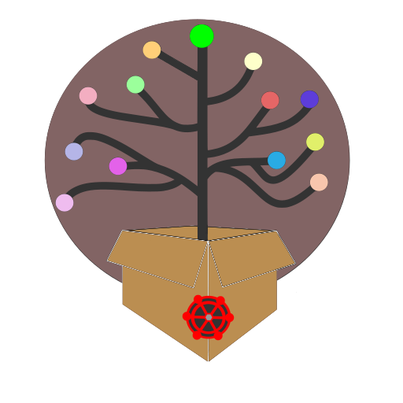

# <div align="center"></div>

# table of contents

- [srcpkg2git: srcpkg-dl, srcpkg2git; git-remote, git-credential-bashelper + *git-credential-shelper*, git-commit (introduction)](#srcpkg2git-srcpkg-dl-srcpkg2git-git-remote-git-credential-bashelper--git-credential-shelper-git-commit) [*[alternate link]*](#srcpkg2git-srcpkg-dl-srcpkg-dl-srcpkg2git-srcpkg2git-git-remote-git-remote-git-credential-bashelper-git-credential-shelper-git-credential-bashelper-git-credential-shelper-git-commit-git-commit)
- [2025 re-release (repackage) | r20250401](#2025-re-release-repackage--r20250401) [*[alternate link]*](#2025-re-release-repackage-r20250401)
- [srcpkg2git releases](#srcpkg2git-releases)
  - [make srcpkg2git release](#make-srcpkg2git-release)
- [srcpkg2git rebase](#srcpkg2git-rebase)
- [programs](#programs)
  - [libraries (lib/)](#libraries-lib---included-git-programs-optional-dependencies) [*[alternate link]*](#libraries-lib-included-git-programs-optional-dependencies)
  - [tools (tools/)](#tools-tools)
- [dependencies](#dependencies)
- [optional dependencies](#optional-dependencies)
- [program order of execution](#program-order-of-execution)
- [variants](#variants)
- [update](#update)
  - [git update](#git-update-git-required)
  - [make update](#make-update-make-required-git-optional)
- [Makefile usage](#makefile-usage)
  - [configure Makefile variant](#configure-makefile-variant)
  - [disable Makefile install target](#disable-makefile-install-target)
  - [Makefile update target](#makefile-update-target)
- [**Makefile install**](#makefile-install)
  - [**system install**](#system-install-not-portable---root-required) [*[alternate link]*](#system-install-not-portable-root-required)
  - [**system package install**](#system-package-install-not-portable---root-required) [*[alternate link]*](#system-package-install-not-portable-root-required)
  - [**user install**](#user-install-semi-portable)
  - [**(user) home install**](#user-home-install-semi-portable-and-optional-git-install)
  - [**no install**](#no-install-portable-archivable-and-optional-git-install)
  - [**git install**](#git-install)
- [**ALPM (pacman) package (PKGBUILD) install**](#alpm-pacman-package-pkgbuild-install)
- [**image/container (Containerfile/Dockerfile)**](#imagecontainer-containerfiledockerfile) [*[alternate link]*](#image-container-containerfile-dockerfile)
  - [**automatically build local (local.Containerfile) image/container**](#automatically-build-local-localcontainerfile-imagecontainer) [*[alternate link]*](#automatically-build-local-local-containerfile-image-container)
  - [**manually build/run local (local.Containerfile) image/container**](#manually-buildrun-local-localcontainerfile-imagecontainer) [*[alternate link]*](#manually-build-run-local-local-containerfile-image-container)
  - [**manually build/run remote (remote.Containerfile/remote-tag.Containerfile) image/container**](#manually-buildrun-remote-remotecontainerfileremote-tagcontainerfile-imagecontainer) [*[alternate link]*](#manually-build-run-remote-remote-containerfile-remote-tag-containerfile-image-container)
  - [**save/load image/container**](#saveload-imagecontainer) [*[alternate link]*](#save-load-image-container)
  - [**remove image/container**](#remove-imagecontainer) [*[alternate link]*](#remove-image-container)
- [**AppImage**](#appimage)
- [**Flatpak**](#flatpak)
- [XDG desktop entry](#xdg-desktop-entry)
- [configuration](#configuration)
- [auto/bot mode](#autobot-mode) [*[alternate link]*](#auto-bot-mode)
- [systemd service](#systemd-service)
- [cron (crontab)](#cron-crontab)
- [uninstall](#uninstall)
- [srcpkg-dl](#srcpkg-dl)
- [srcpkg2git](#srcpkg2git)
  - [automatically deobfuscate source package (src.tar[.gz|.xz])](#automatically-deobfuscate-source-package-srctargzxz) [*[alternate link]*](#automatically-deobfuscate-source-package-src-tar-gz-xz)
  - [manually deobfuscate source package (src.tar[.gz|.xz])](#manually-deobfuscate-source-package-srctargzxz) [*[alternate link]*](#manually-deobfuscate-source-package-src-tar-gz-xz)
- [git-remote](#git-remote)
- [git-credential-bashelper + *git-credential-shelper*](#git-credential-bashelper--git-credential-shelper) [*[alternate link]*](#git-credential-bashelper-git-credential-shelper)
- [git-commit](#git-commit)
- [license](#license)

# srcpkg2git: [srcpkg-dl](#srcpkg-dl), [srcpkg2git](#srcpkg2git); [git-remote](#git-remote), [git-credential-bashelper + *git-credential-shelper*](#git-credential-bashelper--git-credential-shelper), [git-commit](#git-commit)

<div align="center">

**[this humble project (srcpkg2git)](https://gitlab.com/evlaV/srcpkg2git) (especially the following (elaborate) Markdown documentation) is dedicated to the memory of:**

🫶 **[Aaron Swartz](https://en.wikipedia.org/wiki/Aaron_Swartz)** 🫶

**and was proudly made on March 3, 2022 to liberate all packages/repositories/software (GPL or not) from Valve's (and Collabora's and Igalia's) [private GitLab repositories](https://gitlab.steamos.cloud/) ([holo](https://gitlab.steamos.cloud/holo) and [jupiter](https://gitlab.steamos.cloud/jupiter) repositories) to a [public mirror (@gitlab.com/evlaV)](https://gitlab.com/users/evlaV/projects) (<https://gitlab.com/evlaV>) since April 1, 2022**

</div>

[SteamOS 3.x / Steam Deck public mirror (@gitlab.com/evlaV)](https://gitlab.com/users/evlaV/projects) bot (powered by [renewable](https://en.wikipedia.org/wiki/Renewable_energy) **solar** ☀️ and **wind** 🍃) is composed of [this project (srcpkg2git)](https://gitlab.com/evlaV/srcpkg2git) and a series of additional bespoke/custom (private/unpublished) ([automatic](https://en.wikipedia.org/wiki/Automatic_programming)/[generative](https://en.wikipedia.org/wiki/Automatic_programming#Generative_programming)/[meta](https://en.wikipedia.org/wiki/Metaprogramming) programming) software/tools (not included)

> additional (private/unpublished) software/tools (not included) **maintains automation; scheduling/timing, multi-tasking/multi-instancing, power management, networking/[QoS](https://en.wikipedia.org/wiki/Quality_of_service), cryptography, file/data management (generation/modification), git and miscellaneous functions** for **[SteamOS 3.x / Steam Deck public mirror (@gitlab.com/evlaV)](https://gitlab.com/users/evlaV/projects)** (e.g., **[holo-PKGBUILD](https://gitlab.com/evlaV/holo-PKGBUILD)**, **[jupiter-PKGBUILD](https://gitlab.com/evlaV/jupiter-PKGBUILD)**, and **[this project (srcpkg2git)](https://gitlab.com/evlaV/srcpkg2git)** repositories) and (if ever public/published) is *"incompatible"* with the [license](LICENSE.GPL) of [this project (srcpkg2git)](https://gitlab.com/evlaV/srcpkg2git)

**(April 1, 2025):** after over **3 years** [this project (srcpkg2git)](https://gitlab.com/evlaV/srcpkg2git) has (in total) processed (**downloaded**, **unpacked**, and **uploaded**) **several terabytes (TB)** (and counting) of (**mostly redundant/wasteful**) **data** - **"thank you"** Valve for such an **obfuscated**, **redundant**, **demanding**, and **immensely inefficient/wasteful and counterintuitive "release"** of SteamOS sources the past over **3 years**

## 2025 re-release (repackage) | r20250401

[this project (srcpkg2git)](https://gitlab.com/evlaV/srcpkg2git) (made on **March 3, 2022** and (initially) released on **April 1, 2024**) was re-released (repackaged) on **April 1, 2025** (**3 years since public use; 1 year since public release**) with the following (marginal) changes:

- added variants: `srcpkg2git`, `srcpkg-dl`, `srcpkg-dl-bot`
- added `appstream/`; added `appimage` and `flatpak`; updated `make-release.sh`
- **srcpkg-dl**: added `holo-3.7` and `jupiter-3.7` support
- **srcpkg-dl**: added **srcpkg2git** (blind) forwarder / passthrough
- updated documentation (`README.md`)
- cosmetic changes
- `pacman-pkgbuild/` -> `alpm/`
- removed `no-install*.Containerfile/Dockerfile`
- removed (some) commented, old, obsolete, redundant, unused and/or residual code
- synchronized/squashed program versioning

### todo

- [ ] finish implementing appdata/metainfo for `appimage` variants (*temporarily excluded/omitted for now*)

## srcpkg2git releases

> [this project (srcpkg2git)](https://gitlab.com/evlaV/srcpkg2git) is an/a accrescent/continuous release

### GitLab release branches ([@gitlab.com/evlaV](https://gitlab.com/evlaV))

[**master**](https://gitlab.com/evlaV/srcpkg2git/-/tree/master)

**tar**:

- 📦[**srcpkg2git-master.tar.gz**](https://gitlab.com/evlaV/srcpkg2git/-/archive/master/srcpkg2git-master.tar.gz)
- 📦[**srcpkg2git-master.tar.bz2**](https://gitlab.com/evlaV/srcpkg2git/-/archive/master/srcpkg2git-master.tar.bz2)
- 📦[**srcpkg2git-master.tar**](https://gitlab.com/evlaV/srcpkg2git/-/archive/master/srcpkg2git-master.tar)

**zip**:

- 📦[**srcpkg2git-master.zip**](https://gitlab.com/evlaV/srcpkg2git/-/archive/master/srcpkg2git-master.zip) *zip can't retain file permissions (e.g., executables) - `chmod` recommended*

### GitLab release tags ([@gitlab.com/evlaV](https://gitlab.com/evlaV))

**[0.1](https://gitlab.com/evlaV/srcpkg2git/-/tags/0.1) (tag) | [0.1](https://gitlab.com/evlaV/srcpkg2git/-/releases/0.1) (release)**

**tar**:

- 📦[**srcpkg2git-0.1.tar.gz**](https://gitlab.com/evlaV/srcpkg2git/-/archive/0.1/srcpkg2git-0.1.tar.gz)
- 📦[**srcpkg2git-0.1.tar.bz2**](https://gitlab.com/evlaV/srcpkg2git/-/archive/0.1/srcpkg2git-0.1.tar.bz2)
- 📦[**srcpkg2git-0.1.tar**](https://gitlab.com/evlaV/srcpkg2git/-/archive/0.1/srcpkg2git-0.1.tar)

**zip**:

- 📦[**srcpkg2git-0.1.zip**](https://gitlab.com/evlaV/srcpkg2git/-/archive/0.1/srcpkg2git-0.1.zip) *zip can't retain file permissions (e.g., executables) - `chmod` recommended*

---

### Codeberg release branches ([@codeberg.org/evlaV](https://codeberg.org/evlaV))

[**master**](https://codeberg.org/evlaV/srcpkg2git/src/branch/master)

**tar**:

- 📦[**srcpkg2git-master.tar.gz**](https://codeberg.org/evlaV/srcpkg2git/archive/master.tar.gz)

**zip**:

- 📦[**srcpkg2git-master.zip**](https://codeberg.org/evlaV/srcpkg2git/archive/master.zip) *zip can't retain file permissions (e.g., executables) - `chmod` recommended*

### Codeberg release tags ([@codeberg.org/evlaV](https://codeberg.org/evlaV))

**[0.1](https://codeberg.org/evlaV/srcpkg2git/releases/tag/0.1) (tag/release)**

**tar**:

- 📦[**srcpkg2git-0.1.tar.gz**](https://codeberg.org/evlaV/srcpkg2git/archive/0.1.tar.gz)

**zip**:

- 📦[**srcpkg2git-0.1.zip**](https://codeberg.org/evlaV/srcpkg2git/archive/0.1.zip) *zip can't retain file permissions (e.g., executables) - `chmod` recommended*

### make srcpkg2git release

> [this project (srcpkg2git)](https://gitlab.com/evlaV/srcpkg2git) is an/a accrescent/continuous release

automatically makes/uses (a self-contained) directory (`srcpkg2git` or `srcpkg2git-0.1`) in project/git root/working directory `$PWD` (`$PWD/srcpkg2git` or `$PWD/srcpkg2git-0.1`) for source packaging and AppImage creation/generation

```sh
./make-release.sh
./tools/make-release.sh

sh make-release.sh
sh tools/make-release.sh
```

```sh
usage:
  make-release.sh [version] [-c] [-h] [-u]

 e.g.:
  make-release.sh 0.1 -c

positional arguments:
  version          version number (e.g., 0.1)

options:
  -c, --clean      clean/remove (temporary) source dir (srcpkg2git/) after make
  -h, --help       show this help message and exit
  -u, --update     sync/update git repository (git pull) before make

  --skip-appimage  skip making AppImage releases
  --skip-flatpak   skip making Flatpak releases
  --skip-image     skip image/container releases
  --skip-srcpkg    skip making srcpkg releases
  --skip-tar       skip making tarball (tar.*) releases
  --skip-zip       skip making zip release

  --docker         use 'docker' instead of 'podman' to make image/container
  --tar-lzip       use 'tar' instead of 'lzip' to make tar.lzip
  --tar-zstd       use 'tar' instead of 'zstd' to make tar.zst
  --update-ait     force update (remove/redownload) appimagetool.AppImage
```

**source packages**

> `tar`, `lzip`, `zstd`, and `zip` respectively required

> use `tar` instead of `lzip` or `zstd` with options `--tar-lzip` and/or `--tar-zstd`

**srcpkg**:

- 📦./**srcpkg2git-0.1.src.tar.gz** - *`tar` required*
- 📦./**srcpkg2git-0.1.src.tar.xz** - *`tar` required*

**tar**:

- 📦./**srcpkg2git-0.1.tar** - *`tar` required*
- 📦./**srcpkg2git-0.1.tar.bz2** - *`tar` required*
- 📦./**srcpkg2git-0.1.tar.gz** - *`tar` required*
- 📦./**srcpkg2git-0.1.tar.lz** - *`tar` required - `lzip` optionally required*
- 📦./**srcpkg2git-0.1.tar.lzma** - *`tar` required - ~~`xz` or `lzma` optionally required~~*
- 📦./**srcpkg2git-0.1.tar.xz** - *`tar` required*
- 📦./**srcpkg2git-0.1.tar.zst** - *`tar` required - `zstd` optionally required*

**zip**:

- 📦./**srcpkg2git-0.1.zip** - *`zip` required - zip can't retain file permissions (e.g., executables) - `chmod` recommended*

> *[AppImage AppDir](appimage/) (`./appimage/[variant]/`) symbolic links (symlinks/soft links) (included in git repository) automatically converted to files (symlink -> file) in the made (generated by `make-release.sh`) source packages listed above*

> [AppImage AppDir](appimage/) (`./appimage/[variant]/`) contained in the made (generated by `make-release.sh`) source packages listed above do not contain external (out of scope) symbolic links (symlinks/soft links) (included in git repository) i.e., symbolic links (symlinks/soft links) are automatically replaced with respective pointed file before building source packages and AppImages

**AppImages**

> see: [variants](#variants) for more information

> `uname` (coreutils), `curl` or `wget`, and `chmod` required

**srcpkg2git**:

- 📦./**srcpkg2git-0.1-aarch64.AppImage**
- 📦./**srcpkg2git-0.1-armhf.AppImage**
- 📦./**srcpkg2git-0.1-i686.AppImage**
- 📦./**srcpkg2git-0.1-x86_64.AppImage**

**srcpkg-dl**:

- 📦./**srcpkg-dl-0.1-aarch64.AppImage**
- 📦./**srcpkg-dl-0.1-armhf.AppImage**
- 📦./**srcpkg-dl-0.1-i686.AppImage**
- 📦./**srcpkg-dl-0.1-x86_64.AppImage**

**srcpkg-dl-bot**:

- 📦./**srcpkg-dl-bot-0.1-aarch64.AppImage**
- 📦./**srcpkg-dl-bot-0.1-armhf.AppImage**
- 📦./**srcpkg-dl-bot-0.1-i686.AppImage**
- 📦./**srcpkg-dl-bot-0.1-x86_64.AppImage**

> [AppImage AppDir](appimage/) (`./appimage/[variant]/`) may contain external (out of scope) symbolic links (symlinks/soft links) (included in git repository) which must be replaced with respective pointed file before building AppImage; symbolic links (symlinks/soft links) (included in git repository) automatically replaced by `make-release.sh`

**Flatpaks**

> see: [variants](#variants) for more information

> `flatpak` and `flatpak-builder` required

> runs/uses `flatpak --supported-arches` output to detect and build any/all Flatpak supported architectures

**srcpkg2git**:

- 📦./**srcpkg2git-0.1-aarch64.flatpak**
- 📦./**srcpkg2git-0.1-armhf.flatpak**
- 📦./**srcpkg2git-0.1-i686.flatpak**
- 📦./**srcpkg2git-0.1-x86_64.flatpak**

**srcpkg-dl**:

- 📦./**srcpkg-dl-0.1-aarch64.flatpak**
- 📦./**srcpkg-dl-0.1-armhf.flatpak**
- 📦./**srcpkg-dl-0.1-i686.flatpak**
- 📦./**srcpkg-dl-0.1-x86_64.flatpak**

**srcpkg-dl-bot**:

- 📦./**srcpkg-dl-bot-0.1-aarch64.flatpak**
- 📦./**srcpkg-dl-bot-0.1-armhf.flatpak**
- 📦./**srcpkg-dl-bot-0.1-i686.flatpak**
- 📦./**srcpkg-dl-bot-0.1-x86_64.flatpak**

**images/containers (Containerfile/Dockerfile)**

> see: [variants](#variants) for more information

> `podman` or `docker` required and `gzip` respectively required

**srcpkg2git**:

- 📦./**srcpkg2git-0.1.tar**
- 📦./**srcpkg2git-0.1.tar.gz** - *`gzip` required*

**srcpkg-dl**:

- 📦./**srcpkg-dl-0.1.tar**
- 📦./**srcpkg-dl-0.1.tar.gz** - *`gzip` required*

**srcpkg-dl-bot**:

- 📦./**srcpkg-dl-bot-0.1.tar**
- 📦./**srcpkg-dl-bot-0.1.tar.gz** - *`gzip` required*

## srcpkg2git rebase

> [this project (srcpkg2git)](https://gitlab.com/evlaV/srcpkg2git) is an/a accrescent/continuous release

[this repository (srcpkg2git)](https://gitlab.com/evlaV/srcpkg2git) and its affiliated [tags](https://gitlab.com/evlaV/srcpkg2git/-/tags) may occasionally (and repeatedly) be rebased, which will (destructively) remove obsolete commit history and data, but may disrupt normal git fetch/pull (merge) operations; if you receive a branch diverged error message upon git fetch/pull (merge):

```sh
git fetch
git rebase
```

or alternatively:

```sh
git pull --rebase
```

**this will result in (local) commit history and data loss**; *commit history and data loss is composed/consisting completely of obsolete data which has since been depreciated or replaced by (a) newer/later revision(s)*

## programs

- **[srcpkg-dl](srcpkg-dl.sh)** - source package (src.tar[.gz|.xz]) downloader
- **[srcpkg2git](srcpkg2git.sh)** - source package (src.tar[.gz|.xz]) to git converter/deobfuscator

### libraries (lib/) - included (git) programs (optional dependencies)

- [git-remote](lib/git-remote.sh) - setup and push local git to git remote and optionally integrate **git-credential-bashelper**
  - [git-credential-bashelper](lib/git-credential-bashelper.sh) - git credential helper (bash) - enable git authentication automation via HTTP(S)
- *[git-credential-shelper](lib/git-credential-shelper.sh)* - git credential helper (sh) - enable git authentication automation via HTTP(S)
- [git-commit](lib/git-commit.sh) - [shorthand](https://en.wikipedia.org/wiki/Shorthand) [API](https://en.wikipedia.org/wiki/API) library for making local git commit (with specified timestamp)

### tools (tools/)

- [make-release](tools/make-release.sh) - make srcpkg2git tarball (tar.*) releases, AppImages, and Flatpaks

## dependencies

[srcpkg-dl](srcpkg-dl.sh), [srcpkg2git](srcpkg2git.sh), [git-remote](lib/git-remote.sh), [git-credential-bashelper](lib/git-credential-bashelper.sh) + *[git-credential-shelper](lib/git-credential-shelper.sh)*, [git-commit](lib/git-commit.sh):

- [bash](https://www.gnu.org/software/bash/) - GNU **B**ourne-**A**gain **SH**ell

---

[srcpkg-dl](srcpkg-dl.sh) - source package (src.tar[.gz|.xz]) downloader:

- [curl](https://curl.se/download.html) - transfer a URL
- [grep](https://www.gnu.org/software/grep/) - print lines that match patterns
- [libxml2](https://gitlab.gnome.org/GNOME/libxml2/-/releases) - XML C parser and toolkit
  - [xmllint](https://gitlab.gnome.org/GNOME/libxml2/-/releases) - command line XML tool

---

[srcpkg2git](srcpkg2git.sh) - source package (src.tar[.gz|.xz]) to git converter/deobfuscator:

- [git](https://git-scm.com/downloads) - the stupid content tracker
- [tar](https://www.gnu.org/software/tar/) - an archiving utility

---

[git-remote](lib/git-remote.sh), [git-credential-bashelper](lib/git-credential-bashelper.sh) + *[git-credential-shelper](lib/git-credential-shelper.sh)*, [git-commit](lib/git-commit.sh):

- [git](https://git-scm.com/downloads) - the stupid content tracker

---

*[git-credential-shelper](lib/git-credential-shelper.sh)* - git credential helper (sh) - enable git authentication automation via HTTP(S):

- sh ([POSIX](https://en.wikipedia.org/wiki/POSIX)) - [Bourne shell (sh)](https://en.wikipedia.org/wiki/Bourne_shell) - e.g., [Almquist shell (ash)](https://en.wikipedia.org/wiki/Almquist_shell), [Debian Almquist shell (dash)](https://en.wikipedia.org/wiki/Almquist_shell#Dash), [BusyBox](https://en.wikipedia.org/wiki/BusyBox) ([Almquist shell (ash)](https://en.wikipedia.org/wiki/Almquist_shell) or [hush shell](https://en.wikipedia.org/wiki/BusyBox#Features)), [KornShell (ksh)](https://en.wikipedia.org/wiki/KornShell), [Z shell (zsh)](https://en.wikipedia.org/wiki/Z_shell)

   or:

- *[bash](https://www.gnu.org/software/bash/)* - GNU **B**ourne-**A**gain **SH**ell

---

[make-release](tools/make-release.sh) - make srcpkg2git tarball (tar.*) releases, AppImages, and Flatpaks:

- sh ([POSIX](https://en.wikipedia.org/wiki/POSIX)) - [Bourne shell (sh)](https://en.wikipedia.org/wiki/Bourne_shell) - e.g., [Almquist shell (ash)](https://en.wikipedia.org/wiki/Almquist_shell), [Debian Almquist shell (dash)](https://en.wikipedia.org/wiki/Almquist_shell#Dash), [BusyBox](https://en.wikipedia.org/wiki/BusyBox) ([Almquist shell (ash)](https://en.wikipedia.org/wiki/Almquist_shell) or [hush shell](https://en.wikipedia.org/wiki/BusyBox#Features)), [KornShell (ksh)](https://en.wikipedia.org/wiki/KornShell), [Z shell (zsh)](https://en.wikipedia.org/wiki/Z_shell)

   or:

- *[bash](https://www.gnu.org/software/bash/)* - GNU **B**ourne-**A**gain **SH**ell

## optional dependencies

[srcpkg-dl](srcpkg-dl.sh), [srcpkg2git](srcpkg2git.sh), [git-remote](lib/git-remote.sh) + [git-commit](lib/git-commit.sh):

- [coreutils](https://www.gnu.org/software/coreutils/) - GNU core utilities
  - [base64](https://www.gnu.org/software/coreutils/) - base64 encode/decode data and print to standard output
- [openssl](https://github.com/openssl/openssl/releases) - OpenSSL command line program
- [util-linux](https://github.com/util-linux/util-linux/tags) - random collection of Linux utilities
  - [rev](https://github.com/util-linux/util-linux/tags) - reverse lines characterwise
- [vim](https://github.com/vim/vim/tags) - **V**i **IM**proved, a programmer's text editor
  - [xxd](https://github.com/vim/vim/tags) - make a hex dump or do the reverse

---

[srcpkg-dl](srcpkg-dl.sh) - source package (src.tar[.gz|.xz]) downloader:

- [coreutils](https://www.gnu.org/software/coreutils/) - GNU core utilities
  - [date](https://www.gnu.org/software/coreutils/) - print or set the system date and time
  - [sleep](https://www.gnu.org/software/coreutils/) - delay for a specified amount of time
  - [wc](https://www.gnu.org/software/coreutils/) - print newline, word, and byte counts for each file
- [srcpkg2git](srcpkg2git.sh) - source package (src.tar[.gz|.xz]) to git converter/deobfuscator

---

[srcpkg2git](srcpkg2git.sh) - source package (src.tar[.gz|.xz]) to git converter/deobfuscator:

- [coreutils](https://www.gnu.org/software/coreutils/) - GNU core utilities
  - [realpath](https://www.gnu.org/software/coreutils/) - print the resolved path
  - [touch](https://www.gnu.org/software/coreutils/) - change file timestamps
- [curl](https://curl.se/download.html) - transfer a URL
- [findutils](https://www.gnu.org/software/findutils/) - GNU basic directory searching utilities to locate files
  - [find](https://www.gnu.org/software/findutils/) - search for files in a directory hierarchy
- [git-remote](lib/git-remote.sh) - setup and push local git to git remote and optionally integrate **git-credential-bashelper**

---

[git-remote](lib/git-remote.sh) - setup and push local git to git remote and optionally integrate **git-credential-bashelper**:

- [git-credential-bashelper](lib/git-credential-bashelper.sh) - git credential helper (bash)

---

[git-credential-bashelper](lib/git-credential-bashelper.sh) + *[git-credential-shelper](lib/git-credential-shelper.sh)* - git credential helper (bash/sh) - enable git authentication automation via HTTP(S):

- [coreutils](https://www.gnu.org/software/coreutils/) - GNU core utilities
  - [head](https://www.gnu.org/software/coreutils/) - output the first part of files

or:

- [coreutils](https://www.gnu.org/software/coreutils/) - GNU core utilities
  - [cat](https://www.gnu.org/software/coreutils/) - concatenate files and print on the standard output

---

[git-commit](lib/git-commit.sh) - [shorthand](https://en.wikipedia.org/wiki/Shorthand) [API](https://en.wikipedia.org/wiki/API) library for making local git commit (with specified timestamp)

- [coreutils](https://www.gnu.org/software/coreutils/) - GNU core utilities
  - [date](https://www.gnu.org/software/coreutils/) - print or set the system date and time

---

[make-release](tools/make-release.sh) - make srcpkg2git tarball (tar.*) releases, AppImages, and Flatpaks:

- [coreutils](https://www.gnu.org/software/coreutils/) - GNU core utilities
  - [chmod](https://www.gnu.org/software/coreutils/) - change file mode bits
  - [touch](https://www.gnu.org/software/coreutils/) - change file timestamps
  - [uname](https://www.gnu.org/software/coreutils/) - print system information
- [curl](https://curl.se/download.html) - transfer a URL
- [git](https://git-scm.com/downloads) - the stupid content tracker
- [lzip](https://www.nongnu.org/lzip/) - reduces the size of files
- [tar](https://www.gnu.org/software/tar/) - an archiving utility
- [wget](https://www.gnu.org/software/wget/) - the non-interactive network downloader
- [zip](https://infozip.sourceforge.net/Zip.html) - package and compress (archive) files
- [zstd](https://github.com/facebook/zstd/releases) - compress or decompress .zst files

## program order of execution

***download source package(s) -> unpack/convert/deobfuscate source package(s) -> setup and push local git to git remote***:

**[srcpkg-dl](srcpkg-dl.sh) -> [[srcpkg2git](srcpkg2git.sh)] -> [[git-remote](lib/git-remote.sh)] -> [[git-credential-bashelper](lib/git-credential-bashelper.sh)]**

```
srcpkg-dl -> [srcpkg2git]
                  |
             [git-remote]
                  |
      [git-credential-bashelper]
```

or:

***unpack/convert/deobfuscate source package(s) -> setup and push local git to git remote***:

**[srcpkg2git](srcpkg2git.sh) -> [[git-remote](lib/git-remote.sh)] -> [[git-credential-bashelper](lib/git-credential-bashelper.sh)]**

```
        srcpkg2git
            |
       [git-remote]
            |
[git-credential-bashelper]
```

### skip srcpkg-dl and forward to srcpkg2git (srcpkg-dl -> srcpkg2git)

***~~download source package(s)~~ -> unpack/convert/deobfuscate source package(s) -> setup and push local git to git remote***:

**~~[srcpkg-dl](srcpkg-dl.sh)~~ -> [srcpkg2git](srcpkg2git.sh) -> [[git-remote](lib/git-remote.sh)] -> [[git-credential-bashelper](lib/git-credential-bashelper.sh)]**

> see: [srcpkg-dl](#srcpkg-dl) for detailed usage instructions

```sh
srcpkg-dl --srcpkg2git
```

```sh
./srcpkg-dl.sh --srcpkg2git
bash srcpkg-dl.sh --srcpkg2git
```

this feature/function is particularly useful to "breach" collection/combination/multiple/unified binary images/containers (e.g., **srcpkg-dl** and **srcpkg-dl-bot** variants of [image/container (Containerfile/Dockerfile)](#imagecontainer-containerfiledockerfile) [*[alternate link]*](#image-container-containerfile-dockerfile), [AppImage](#appimage), and [Flatpak](#flatpak)) to skip [program order of execution](#program-order-of-execution) to perform **srcpkg2git** functions/operations/tasks with **srcpkg-dl**

## variants

> ℹ️ variants apply only to **build/install/launcher (make/alpm/xdg and container/appimage/flatpak)** made from [**srcpkg2git** sources](#srcpkg2git-releases) (typically via `make-release.sh`)

(included) [Makefile](Makefile) (`./Makefile`) and (included) [PKGBUILD](alpm/) (`./alpm/`) installs/packages **srcpkg-dl-bot variant by default** (can be manually reconfigured/overriden)

*minimal (standalone) variant*:

- **srcpkg2git**: excludes/removes **srcpkg-dl** (includes/provides only **srcpkg2git**)
  - e.g., `./srcpkg2git-{local,remote,remote-tag}.Containerfile`
  - e.g., `./appimage/srcpkg2git/`
  - e.g., `srcpkg2git-{local,remote}.yaml`

*full (AIO) variants*:

- **srcpkg-dl**: includes/provides both (**srcpkg-dl** and **srcpkg2git**)
  - e.g., `./srcpkg-dl-{local,remote,remote-tag}.Containerfile`
  - e.g., `./appimage/srcpkg-dl/`
  - e.g., `srcpkg-dl-{local,remote}.yaml`
- **srcpkg-dl-bot**: includes/provides both (**srcpkg-dl** and **srcpkg2git**) with *auto/bot mode enabled*
  - e.g., `./srcpkg-dl-bot-{local,remote,remote-tag}.Containerfile`
  - e.g., `./appimage/srcpkg-dl-bot/`
  - e.g., `srcpkg-dl-bot-{local,remote}.yaml`

| variant: | srcpkg-dl | srcpkg2git | auto/bot mode | environment/variant configuration |
| ---: | :---: | :---: | :---: | :---: |
| **srcpkg2git:** | ❌ | ✅ | *configurable* | *Makefile*, *ALPM (pacman) package (PKGBUILD)*, **image/container (Containerfile/Dockerfile)**, **AppImage**, **Flatpak** |
| **srcpkg-dl:** | ✅ | ✅ | *configurable* | *Makefile*, *ALPM (pacman) package (PKGBUILD)*, **image/container (Containerfile/Dockerfile)**, **AppImage**, **Flatpak** |
| **srcpkg-dl-bot:** | ✅ | ✅ | ✔️ | **Makefile**, **ALPM (pacman) package (PKGBUILD)**, **image/container (Containerfile/Dockerfile)**, **AppImage**, **Flatpak** |

> ✅ = included | ❌ = excluded | ✔️ = enabled | *configurable* | **default configuration**

> "*configurable*" = enable/use auto/bot mode (no prompt) with `--auto` argument/option or export/set **SRCPKG_AUTO** variable

> see: `./appimage/[variant]/` or `./cron/[variant]/` or `./systemd/[variant]/` or `./xdg/[variant]/` or `./[variant]-{local,remote,remote-tag}.Containerfile` or `./[variant].mk` or `./[variant]-{local,remote}.yaml` for variants

## update

### git update (git required)

```sh
git pull
```

or alternatively/directly:

```sh
git fetch
git rebase
```

### make update (make required, git optional)

```sh
make
```

or alternatively/directly:

```sh
make update
```

`make` sure to (re)`install` after update (e.g., `make install` i.e., `make install-user-local-bin`)

## Makefile usage

`make help` will print the following usage:

```sh
make usage:
make [help|install|uninstall[-all]|update]

make -> make update

make install usage:
make install[-systemd][-system[-bin|-local-bin|-package]]
make install[-systemd][-user[-bin|-home|-home-git|-home-update|-local-bin]]

make install-system -> install-system-local-bin
make install[-user] -> install-user-local-bin

make install-systemd-system -> install-systemd-system-local-bin
make install-systemd[-user] -> install-systemd-user-local-bin

make install-systemd-user-home-common
make install-user-home-update
```

### configure Makefile variant

> see: [variants](#variants) for more information

> defaults to `srcpkg-dl-bot` if not provided (or invalid)

```sh
# srcpkg2git variant
make variant=srcpkg2git [target]
```

```sh
# srcpkg-dl variant
make variant=srcpkg-dl [target]
```

```sh
#srcpkg-dl-bot variant
make variant=srcpkg-dl-bot [target]
```

or:

```sh
# srcpkg2git variant
cp ./srcpkg2git.mk ./variant.mk
make [target]
```

```sh
# srcpkg-dl variant
cp ./srcpkg-dl.mk ./variant.mk
make [target]
```

```sh
# srcpkg-dl-bot variant
cp ./srcpkg-dl-bot.mk ./variant.mk
make [target]
```

### disable Makefile install target

disable `Makefile` install target(s) by `touch`ing the corresponding/respective file (targets: **help**, **uninstall**, ~~**uninstall-all**~~, and ~~**update**~~ are exempt i.e., **cannot be disabled**)

for example, disable target **install-system-bin**:

```sh
touch install-system-bin
```

make will no longer build or install **install-system-bin** target and will only print `make: 'install-system-bin' is up to date.` when running `make install-system-bin`

re-enable a disabled target (i.e., reverse `touch` process) by removing the corresponding/respective `touch`ed file:

```sh
rm install-system-bin
```

> see: [phony targets](https://www.gnu.org/software/make/manual/html_node/Phony-Targets.html) for more information on how/why this works

### Makefile update target

`make` or `make update` will update pre-installed **no install**, **user-home**, and (with optional `git` dependency) **user-home-git** install targets or automatically download (`git clone`) [this entire project (srcpkg2git)](https://gitlab.com/evlaV/srcpkg2git) (**no install**) in current working directory with nothing more than a (ubiquitous) [network connection](https://en.wikipedia.org/wiki/Computer_network), `git`, `make`, (included) [Makefile](Makefile) (`./Makefile`), and the `make` or `make update` command:

```sh
cd /some/path
# /some/path$
curl -O https://gitlab.com/evlaV/srcpkg2git/-/raw/master/Makefile
make
# installed to: /some/path/srcpkg2git (no install)
```

or:

```sh
make
```

or alternatively/directly:

```sh
make update
```

- creative **user-home-git** install (hack) with `Makefile` and `make` or `make update` command:

   ```sh
   cp ./Makefile ~
   cd ~
   # ~$
   make
   # installed to: ~/srcpkg2git (user-home-git install)
   ```

- i.e.:

   ```sh
   cp ./Makefile "$HOME"
   cd "$HOME"
   # ~$
   make
   # installed to: $HOME/srcpkg2git (user-home-git install)
   ```

- or install in any directory/path (other than `~` i.e., `$HOME`) for a fully portable **no install** in current working directory (`$PWD/srcpkg2git`):

   ```sh
   cp ./Makefile /some/path
   cd /some/path
   # /some/path$
   make
   # installed to: /some/path/srcpkg2git (no install)
   ```

   > see: **[no install](#no-install-portable-archivable-and-optional-git-install)** for **no install** configuration setup

## Makefile install

### system install (not portable) - root required

**system install paths:**

- **binaries (bin)**: `/usr/local/bin`
- **configuration**: `~/.config` i.e., `$HOME/.config`
- **systemd service**: `~/.local/share/systemd/user` i.e., `$HOME/.local/share/systemd/user`
- **XDG desktop entry**: `~/.local/share/applications` i.e., `$HOME/.local/share/applications`

install **srcpkg2git** to `/usr/local/bin` **(root required)**:

```sh
make install-system
```

or alternatively/directly:

```sh
make install-system-local-bin
```

install **srcpkg2git** to `/usr/local/bin` and **systemd service** to `/etc/systemd/user` **(root required)**:

```sh
make install-systemd-system
```

or alternatively/directly:

```sh
make install-systemd-system-local-bin
```

---

> ⚠️ **system-bin** and **systemd-system-bin** install targets are designed/intended for (and conflict with / overwrite) system package manager / making system package (not install) ⚠️
>
> 1. conflicts with / overwrites system package manager
> 2. ignored (not removed/uninstalled) by uninstall target

install **srcpkg2git** to `/usr/bin` **(root required)**:

```sh
# intended for making system package (not install)
make install-system-bin
```

install **srcpkg2git** to `/usr/bin` and **systemd service** to `/etc/systemd/user` **(root required)**:

```sh
# intended for making system package (not install)
make install-systemd-system-bin
```

### system package install (not portable) - root required

> ⚠️ **system-package** and **systemd-system-package** install targets are designed/intended for (and conflicts with / overwrites) system package manager / making system package (not install) ⚠️
>
> 1. conflicts with / overwrites system package manager
> 2. ignored (not removed/uninstalled) by uninstall target

**system package install paths:**

- **binaries (bin)**: `/usr/bin`
- **configuration**: `/etc`
- **systemd service**: `/usr/lib/systemd/user`
- **XDG desktop entry**: `/usr/share/applications`

install **srcpkg2git** to `/usr/bin` **(root required)**:

```sh
# intended for making system package (not install)
make install-system-package
```

install **srcpkg2git** to `/usr/bin` and **systemd service** to `/usr/lib/systemd/user` **(root required)**:

```sh
# intended for making system package (not install)
make install-systemd-system-package
```

### user install (semi-portable)

**user install paths:**

- **binaries (bin)**: `~/.local/bin` i.e., `$HOME/.local/bin` or `~/bin` i.e., `$HOME/bin`
- **configuration**: `~/.config` i.e., `$HOME/.config`
- **systemd service**: `~/.local/share/systemd/user` i.e., `$HOME/.local/share/systemd/user`
- **XDG desktop entry**: `~/.local/share/applications` i.e., `$HOME/.local/share/applications`

install **srcpkg2git** to `~/.local/bin` i.e., `$HOME/.local/bin`:

```sh
make install
```

or alternatively/directly:

```sh
make install-user
```

or alternatively/more directly:

```sh
make install-user-local-bin
```

install **srcpkg2git** to `~/.local/bin` i.e., `$HOME/.local/bin` and **systemd service** to `~/.local/share/systemd/user` i.e., `$HOME/.local/share/systemd/user`:

```sh
make install-systemd
```

or alternatively/directly:

```sh
make install-systemd-user
```

or alternatively/more directly:

```sh
make install-systemd-user-local-bin
```

---

install **srcpkg2git** to `~/bin` i.e., `$HOME/bin`:

```sh
make install-user-bin
```

install **srcpkg2git** to `~/bin` i.e., `$HOME/bin` and **systemd service** to `~/.local/share/systemd/user` i.e., `$HOME/.local/share/systemd/user`:

```sh
make install-systemd-user-bin
```

### (user) home install (semi-portable and optional git install)

**home install** is a user focused install which (intentionally) doesn't preserve uncommitted modifications - see the following notice/warning

> ⚠️ destructive install/update PATH: use of this install PATH (`$HOME/srcpkg2git`) for (git) modification/development/contribution/merging (uncommitted changes) is not recommended ⚠️

**home install** has an optional alternative git install target (**user-home-git**); to easily/quickly update **srcpkg2git**, simply update [this repository (srcpkg2git)](https://gitlab.com/evlaV/srcpkg2git) (e.g., `git fetch/pull` or `make`) located at `~/srcpkg2git` i.e., `$HOME/srcpkg2git` (see: **[git install](#git-install)**)

**(user) home install paths:**

- **binaries (bin)**: `~/srcpkg2git` i.e., `$HOME/srcpkg2git`
- **configuration**: `~/srcpkg2git` i.e., `$HOME/srcpkg2git`
- **systemd service**: `~/.local/share/systemd/user` i.e., `$HOME/.local/share/systemd/user`
- **XDG desktop entry**: `~/.local/share/applications` i.e., `$HOME/.local/share/applications`

install **srcpkg2git** to `~/srcpkg2git` i.e., `$HOME/srcpkg2git`:

```sh
make install-user-home
```

or alternatively [git install](#git-install) **srcpkg2git** ((locally) git clone [this repository (srcpkg2git)](https://gitlab.com/evlaV/srcpkg2git)) to `~/srcpkg2git` i.e., `$HOME/srcpkg2git`:

```sh
make install-user-home-git
```

install **srcpkg2git** to `~/srcpkg2git` i.e., `$HOME/srcpkg2git` and **systemd service** to `~/.local/share/systemd/user` i.e., `$HOME/.local/share/systemd/user`:

```sh
make install-systemd-user-home
```

or alternatively [git install](#git-install) **srcpkg2git** ((locally) git clone [this repository (srcpkg2git)](https://gitlab.com/evlaV/srcpkg2git)) to `~/srcpkg2git` i.e., `$HOME/srcpkg2git` and install **systemd service** to `~/.local/share/systemd/user` i.e., `$HOME/.local/share/systemd/user`:

```sh
make install-systemd-user-home-git
```

---

when [systemd service unit](systemd/) (`./systemd/[variant]/user-home.service`) and/or [XDG desktop entry](xdg/) (`./xdg/[variant]/user-home.desktop`) is **updated/modified** (re)run:

```sh
make
```

or alternatively/directly:

```sh
make update
```

or alternatively/more directly:

```sh
make install-user-home-update
```

or:

```sh
make install-systemd-user-home
```

or:

```sh
make install-systemd-user-home-git
```

---

when [systemd service unit](systemd/) (`./systemd/[variant]/user-home.service`) is **updated/modified** (re)run:

```sh
make install-systemd-user-home-common
```

or:

```sh
make install-systemd-user-home
```

or:

```sh
make install-systemd-user-home-git
```

---

when [XDG desktop entry](xdg/) (`./xdg/[variant]/user-home.desktop`) is **updated/modified** (re)run:

```sh
make install-user-home
```

or:

```sh
make install-user-home-git
```

### no install (portable (archivable) and optional git install)

simply `git clone` or copy/extract/unpack [this repository (srcpkg2git)](https://gitlab.com/evlaV/srcpkg2git) ([zip](https://gitlab.com/evlaV/srcpkg2git/-/archive/master/srcpkg2git-master.zip), [tar.gz](https://gitlab.com/evlaV/srcpkg2git/-/archive/master/srcpkg2git-master.tar.gz), [tar.bz2](https://gitlab.com/evlaV/srcpkg2git/-/archive/master/srcpkg2git-master.tar.bz2), [tar](https://gitlab.com/evlaV/srcpkg2git/-/archive/master/srcpkg2git-master.tar)) somewhere/anywhere for a fully portable **no install**

or download/install in any directory/path (other than `~` i.e., `$HOME`) for a fully portable **no install** in current working directory (`$PWD/srcpkg2git`) with nothing more than a (ubiquitous) [network connection](https://en.wikipedia.org/wiki/Computer_network), `git`, `make`, (included) [Makefile](Makefile) (`./Makefile`), and the `make` or `make update` command:

```sh
cd /some/path
# /some/path$
curl -O https://gitlab.com/evlaV/srcpkg2git/-/raw/master/Makefile
make
# installed to: /some/path/srcpkg2git (no install)
```

or:

```sh
cp ./Makefile /some/path
cd /some/path
# /some/path$
make
# installed to: /some/path/srcpkg2git (no install)
```

**no install** is portable and has **[Arch Linux](https://archlinux.org/about/) / [Gentoo](https://www.gentoo.org/get-started/philosophy/)** philosophies e.g., a completely manual setup and configuration - it's up to the user to manually setup and (when necessary) update configuration

setup **[srcpkg2git configuration](#configuration)** (in configuration load order) for **no install**:

```sh
cp ./config/srcpkg-dl.conf.template ./srcpkg-dl.conf
cp ./config/git-remote.conf.template ./git-remote.conf
```

or alternatively (and more/less portable):

```sh
cp ./config/srcpkg-dl.conf.template ~/.config/srcpkg-dl.conf
cp ./config/git-remote.conf.template ~/.config/git-remote.conf
```

i.e.:

```sh
cp ./config/srcpkg-dl.conf.template "$HOME/.config/srcpkg-dl.conf"
cp ./config/git-remote.conf.template "$HOME/.config/git-remote.conf"
```

`srcpkg-dl.conf` and/or `git-remote.conf` may be configured via an editor of your choosing

### git install

simply `git clone` [this repository (srcpkg2git)](https://gitlab.com/evlaV/srcpkg2git):

```sh
git clone https://gitlab.com/evlaV/srcpkg2git.git ~/srcpkg2git
```

i.e.:

```sh
git clone https://gitlab.com/evlaV/srcpkg2git.git "$HOME/srcpkg2git"
```

or alternatively (with make):

```sh
make install-user-home-git
```

or (to additionally install **[systemd service](#systemd-service)**):

```sh
make install-systemd-user-home-git
```

see: [srcpkg2git rebase](#srcpkg2git-rebase) for more information on proper git pull (rebase)

(git) update **srcpkg2git** **(git install)** as easily/quickly as:

```sh
cd ~/srcpkg2git
git pull
```

i.e.:

```sh
cd "$HOME/srcpkg2git"
git pull
```

or alternatively:

```sh
git -C ~/srcpkg2git pull
```

i.e.:

```sh
git -C "$HOME/srcpkg2git" pull
```

or alternatively/directly:

```sh
make update
```

or alternatively:

```sh
make
```

## ALPM (pacman) package (PKGBUILD) install

**ALPM (pacman) package (PKGBUILD) install paths:**

- **binaries (bin)**: `/usr/bin`
- **configuration**: `/etc`
- **systemd service**: `/usr/lib/systemd/user`
- **XDG desktop entry**: `/usr/share/applications`

static (milestone) release (tag):

- [srcpkg2git](alpm/srcpkg2git/PKGBUILD) - remote (git tag) ALPM (pacman) package (PKGBUILD)
- [srcpkg2git-tar](alpm/srcpkg2git-tar/PKGBUILD) - remote (git tag tar) ALPM (pacman) package (PKGBUILD)

dynamic/rolling latest (milestone) release (tag):

- [srcpkg2git-git-tag](alpm/srcpkg2git-git-tag/PKGBUILD) - remote (git tag) ALPM (pacman) package (PKGBUILD)

dynamic/rolling latest ([dogfooding](https://en.wikipedia.org/wiki/Eating_your_own_dog_food)/developer) commit (branch):

- [srcpkg2git-git](alpm/srcpkg2git-git/PKGBUILD) - remote (git branch) ALPM (pacman) package (PKGBUILD)
- [srcpkg2git-local](alpm/srcpkg2git-local/PKGBUILD) - local ALPM (pacman) package (PKGBUILD)

all packages **conflict with and replace each other** i.e., are comparably identical; install (your choice of) one (1) package per ALPM (pacman) system

---

- change directory to respective ALPM (pacman) package (PKGBUILD) directory e.g., `cd ./alpm/srcpkg2git`

make respective ALPM (pacman) package (PKGBUILD):

```sh
makepkg
```

install missing dependencies with ALPM (pacman), then make respective ALPM (pacman) package (PKGBUILD):

```sh
makepkg -s
```

install missing dependencies with ALPM (pacman), then make and install respective ALPM (pacman) package (PKGBUILD):

```sh
makepkg -is
```

install missing dependencies with ALPM (pacman), then clean, make, and install respective ALPM (pacman) package (PKGBUILD):

```sh
makepkg -Cis
```

run `makepkg -h` or see: [makepkg usage](https://wiki.archlinux.org/title/Makepkg#Usage) for detailed usage instructions.

## image/container (Containerfile/Dockerfile)

> see: [variants](#variants) for more information

**Containerfile/Dockerfile (`./[variant]-local.Containerfile`) install paths:**

- **binaries (bin)**: `/usr/bin`
- **configuration**: `/etc`

---

- `./srcpkg-dl.conf` and `./git-remote.conf` required

   ```sh
   cp ./config/srcpkg-dl.conf.template ./srcpkg-dl.conf
   cp ./config/git-remote.conf.template ./git-remote.conf
   ```

   or remotely:

   ```sh
   curl -o srcpkg-dl.conf https://gitlab.com/evlaV/srcpkg2git/-/raw/master/config/srcpkg-dl.conf.template -o git-remote.conf https://gitlab.com/evlaV/srcpkg2git/-/raw/master/config/git-remote.conf.template
   ```

   - `./srcpkg-dl.conf` and `./git-remote.conf` may be configured via an editor of your choosing

   ```sh
   nano ./srcpkg-dl.conf ./git-remote.conf
   vim ./srcpkg-dl.conf ./git-remote.conf
   ```

---

image/container size: **~30MB**

> image/container size subject to change (+/-) based on the size and architecture (e.g., [x86_64](https://dl-cdn.alpinelinux.org/alpine/v3.21/releases/x86_64/alpine-minirootfs-3.21.3-x86_64.tar.gz), [x86](https://dl-cdn.alpinelinux.org/alpine/v3.21/releases/x86/alpine-minirootfs-3.21.3-x86.tar.gz), [aarch64](https://dl-cdn.alpinelinux.org/alpine/v3.21/releases/aarch64/alpine-minirootfs-3.21.3-aarch64.tar.gz), [armhf](https://dl-cdn.alpinelinux.org/alpine/v3.21/releases/armhf/alpine-minirootfs-3.21.3-armhf.tar.gz), or [armv7](https://dl-cdn.alpinelinux.org/alpine/v3.21/releases/armv7/alpine-minirootfs-3.21.3-armv7.tar.gz)) of current/latest container distribution (rootfs) image ([Alpine Linux](https://www.alpinelinux.org/)) and [srcpkg2git](https://gitlab.com/evlaV/srcpkg2git) and all [dependencies](#dependencies) and any/all [optional dependencies](#optional-dependencies)

<details open><summary>Alpine Linux release (4/2025) | v3.21.3 <b>EOL/EOS (End Of Life/Support): 2026-11-01</b></summary><p>

[Alpine Linux rootfs Containerfile/Dockerfile tree (docker-alpine) v3.21](https://github.com/alpinelinux/docker-alpine/tree/v3.21):

<details><summary>x86_64</summary><p>

Alpine Linux ([x86_64](https://en.wikipedia.org/wiki/X86-64)) rootfs [Containerfile/Dockerfile](https://github.com/alpinelinux/docker-alpine/blob/v3.21/x86_64/Dockerfile):

```sh
FROM scratch
ADD https://dl-cdn.alpinelinux.org/alpine/v3.21/releases/x86_64/alpine-minirootfs-3.21.3-x86_64.tar.gz /
CMD ["/bin/sh"]
```

</details>

<details><summary>x86</summary><p>

Alpine Linux ([x86](https://en.wikipedia.org/wiki/X86-64)) rootfs [Containerfile/Dockerfile](https://github.com/alpinelinux/docker-alpine/blob/v3.21/x86/Dockerfile):

```sh
FROM scratch
ADD https://dl-cdn.alpinelinux.org/alpine/v3.21/releases/x86/alpine-minirootfs-3.21.3-x86.tar.gz /
CMD ["/bin/sh"]
```

</details>

<details><summary>aarch64</summary><p>

Alpine Linux ([aarch64](https://en.wikipedia.org/wiki/AArch64)) rootfs [Containerfile/Dockerfile](https://github.com/alpinelinux/docker-alpine/blob/v3.21/aarch64/Dockerfile):

```sh
FROM scratch
ADD https://dl-cdn.alpinelinux.org/alpine/v3.21/releases/aarch64/alpine-minirootfs-3.21.3-aarch64.tar.gz /
CMD ["/bin/sh"]
```

</details>

<details><summary>armhf</summary><p>

Alpine Linux ([armhf](https://en.wikipedia.org/wiki/ARM_architecture_family#Floating-point_(VFP))) rootfs [Containerfile/Dockerfile](https://github.com/alpinelinux/docker-alpine/blob/v3.21/armhf/Dockerfile):

```sh
FROM scratch
ADD https://dl-cdn.alpinelinux.org/alpine/v3.21/releases/armhf/alpine-minirootfs-3.21.3-armhf.tar.gz /
CMD ["/bin/sh"]
```

</details>

<details><summary>armv7</summary><p>

Alpine Linux ([armv7](https://en.wikipedia.org/wiki/ARM_architecture_family#32-bit_architecture)) rootfs [Containerfile/Dockerfile](https://github.com/alpinelinux/docker-alpine/blob/v3.21/armv7/Dockerfile):

```sh
FROM scratch
ADD https://dl-cdn.alpinelinux.org/alpine/v3.21/releases/armv7/alpine-minirootfs-3.21.3-armv7.tar.gz /
CMD ["/bin/sh"]
```

</details>

</details><p>

<details open><summary>Alpine Linux release (4/2024) | v3.19.7 <b>EOL/EOS (End Of Life/Support): 2025-11-01</b></summary><p>

[Alpine Linux rootfs Containerfile/Dockerfile tree (docker-alpine) v3.19](https://github.com/alpinelinux/docker-alpine/tree/v3.19):

<details><summary>x86_64</summary><p>

Alpine Linux ([x86_64](https://en.wikipedia.org/wiki/X86-64)) rootfs [Containerfile/Dockerfile](https://github.com/alpinelinux/docker-alpine/blob/v3.19/x86_64/Dockerfile):

```sh
FROM scratch
ADD https://dl-cdn.alpinelinux.org/alpine/v3.19/releases/x86_64/alpine-minirootfs-3.19.7-x86_64.tar.gz /
CMD ["/bin/sh"]
```

</details>

<details><summary>x86</summary><p>

Alpine Linux ([x86](https://en.wikipedia.org/wiki/X86-64)) rootfs [Containerfile/Dockerfile](https://github.com/alpinelinux/docker-alpine/blob/v3.19/x86/Dockerfile):

```sh
FROM scratch
ADD https://dl-cdn.alpinelinux.org/alpine/v3.19/releases/x86/alpine-minirootfs-3.19.7-x86.tar.gz /
CMD ["/bin/sh"]
```

</details>

<details><summary>aarch64</summary><p>

Alpine Linux ([aarch64](https://en.wikipedia.org/wiki/AArch64)) rootfs [Containerfile/Dockerfile](https://github.com/alpinelinux/docker-alpine/blob/v3.19/aarch64/Dockerfile):

```sh
FROM scratch
ADD https://dl-cdn.alpinelinux.org/alpine/v3.19/releases/aarch64/alpine-minirootfs-3.19.7-aarch64.tar.gz /
CMD ["/bin/sh"]
```

</details>

<details><summary>armhf</summary><p>

Alpine Linux ([armhf](https://en.wikipedia.org/wiki/ARM_architecture_family#Floating-point_(VFP))) rootfs [Containerfile/Dockerfile](https://github.com/alpinelinux/docker-alpine/blob/v3.19/armhf/Dockerfile):

```sh
FROM scratch
ADD https://dl-cdn.alpinelinux.org/alpine/v3.19/releases/armhf/alpine-minirootfs-3.19.7-armhf.tar.gz /
CMD ["/bin/sh"]
```

</details>

<details><summary>armv7</summary><p>

Alpine Linux ([armv7](https://en.wikipedia.org/wiki/ARM_architecture_family#32-bit_architecture)) rootfs [Containerfile/Dockerfile](https://github.com/alpinelinux/docker-alpine/blob/v3.19/armv7/Dockerfile):

```sh
FROM scratch
ADD https://dl-cdn.alpinelinux.org/alpine/v3.19/releases/armv7/alpine-minirootfs-3.19.7-armv7.tar.gz /
CMD ["/bin/sh"]
```

</details>

</details><p>

<details><summary><s>Alpine Linux release (4/2023) | v3.17.10</s> <b>EOL/EOS (End Of Life/Support): 2024-11-22</b></summary><p>

[Alpine Linux rootfs Containerfile/Dockerfile tree (docker-alpine) v3.17](https://github.com/alpinelinux/docker-alpine/tree/v3.17):

<details><summary>x86_64</summary><p>

Alpine Linux ([x86_64](https://en.wikipedia.org/wiki/X86-64)) rootfs [Containerfile/Dockerfile](https://github.com/alpinelinux/docker-alpine/blob/v3.17/x86_64/Dockerfile):

```sh
FROM scratch
ADD https://dl-cdn.alpinelinux.org/alpine/v3.17/releases/x86_64/alpine-minirootfs-3.17.10-x86_64.tar.gz /
CMD ["/bin/sh"]
```

</details>

<details><summary>x86</summary><p>

Alpine Linux ([x86](https://en.wikipedia.org/wiki/X86-64)) rootfs [Containerfile/Dockerfile](https://github.com/alpinelinux/docker-alpine/blob/v3.17/x86/Dockerfile):

```sh
FROM scratch
ADD https://dl-cdn.alpinelinux.org/alpine/v3.17/releases/x86/alpine-minirootfs-3.17.10-x86.tar.gz /
CMD ["/bin/sh"]
```

</details>

<details><summary>aarch64</summary><p>

Alpine Linux ([aarch64](https://en.wikipedia.org/wiki/AArch64)) rootfs [Containerfile/Dockerfile](https://github.com/alpinelinux/docker-alpine/blob/v3.17/aarch64/Dockerfile):

```sh
FROM scratch
ADD https://dl-cdn.alpinelinux.org/alpine/v3.17/releases/aarch64/alpine-minirootfs-3.17.10-aarch64.tar.gz /
CMD ["/bin/sh"]
```

</details>

<details><summary>armhf</summary><p>

Alpine Linux ([armhf](https://en.wikipedia.org/wiki/ARM_architecture_family#Floating-point_(VFP))) rootfs [Containerfile/Dockerfile](https://github.com/alpinelinux/docker-alpine/blob/v3.17/armhf/Dockerfile):

```sh
FROM scratch
ADD https://dl-cdn.alpinelinux.org/alpine/v3.17/releases/armhf/alpine-minirootfs-3.17.10-armhf.tar.gz /
CMD ["/bin/sh"]
```

</details>

<details><summary>armv7</summary><p>

Alpine Linux ([armv7](https://en.wikipedia.org/wiki/ARM_architecture_family#32-bit_architecture)) rootfs [Containerfile/Dockerfile](https://github.com/alpinelinux/docker-alpine/blob/v3.17/armv7/Dockerfile):

```sh
FROM scratch
ADD https://dl-cdn.alpinelinux.org/alpine/v3.17/releases/armv7/alpine-minirootfs-3.17.10-armv7.tar.gz /
CMD ["/bin/sh"]
```

</details>

</details><p>

<details><summary><s>Alpine Linux release (4/2022) | v3.15.11</s> <b>EOL/EOS (End Of Life/Support): 2023-11-01</b></summary><p>

[Alpine Linux rootfs Containerfile/Dockerfile tree (docker-alpine) v3.15](https://github.com/alpinelinux/docker-alpine/tree/v3.15):

<details><summary>x86_64</summary><p>

Alpine Linux ([x86_64](https://en.wikipedia.org/wiki/X86-64)) rootfs [Containerfile/Dockerfile](https://github.com/alpinelinux/docker-alpine/blob/v3.15/x86_64/Dockerfile):

```sh
FROM scratch
ADD https://dl-cdn.alpinelinux.org/alpine/v3.15/releases/x86_64/alpine-minirootfs-3.15.11-x86_64.tar.gz /
CMD ["/bin/sh"]
```

</details>

<details><summary>x86</summary><p>

Alpine Linux ([x86](https://en.wikipedia.org/wiki/X86-64)) rootfs [Containerfile/Dockerfile](https://github.com/alpinelinux/docker-alpine/blob/v3.15/x86/Dockerfile):

```sh
FROM scratch
ADD https://dl-cdn.alpinelinux.org/alpine/v3.15/releases/x86/alpine-minirootfs-3.15.11-x86.tar.gz /
CMD ["/bin/sh"]
```

</details>

<details><summary>aarch64</summary><p>

Alpine Linux ([aarch64](https://en.wikipedia.org/wiki/AArch64)) rootfs [Containerfile/Dockerfile](https://github.com/alpinelinux/docker-alpine/blob/v3.15/aarch64/Dockerfile):

```sh
FROM scratch
ADD https://dl-cdn.alpinelinux.org/alpine/v3.15/releases/aarch64/alpine-minirootfs-3.15.11-aarch64.tar.gz /
CMD ["/bin/sh"]
```

</details>

<details><summary>armhf</summary><p>

Alpine Linux ([armhf](https://en.wikipedia.org/wiki/ARM_architecture_family#Floating-point_(VFP))) rootfs [Containerfile/Dockerfile](https://github.com/alpinelinux/docker-alpine/blob/v3.15/armhf/Dockerfile):

```sh
FROM scratch
ADD https://dl-cdn.alpinelinux.org/alpine/v3.15/releases/armhf/alpine-minirootfs-3.15.11-armhf.tar.gz /
CMD ["/bin/sh"]
```

</details>

<details><summary>armv7</summary><p>

Alpine Linux ([armv7](https://en.wikipedia.org/wiki/ARM_architecture_family#32-bit_architecture)) rootfs [Containerfile/Dockerfile](https://github.com/alpinelinux/docker-alpine/blob/v3.15/armv7/Dockerfile):

```sh
FROM scratch
ADD https://dl-cdn.alpinelinux.org/alpine/v3.15/releases/armv7/alpine-minirootfs-3.15.11-armv7.tar.gz /
CMD ["/bin/sh"]
```

</details>

</details><p>

### automatically build local (local.Containerfile) image/container

```sh
./make-release.sh
./tools/make-release.sh

sh make-release.sh
sh tools/make-release.sh
```

> see: [make srcpkg2git release](#make-srcpkg2git-release) for detailed usage instructions

### manually build/run local (local.Containerfile) image/container

> see: [variants](#variants) for more information

> `docker` may alternatively be used instead of `podman`

local.Containerfile (`./[variant]-local.Containerfile`)

1. build image (immutable)

   ```sh
   # srcpkg-dl-bot variant
   [sudo] podman build -t srcpkg-dl-bot .
   ```

   or alternatively/directly:

   ```sh
   # srcpkg2git variant
   [sudo] podman build -f ./srcpkg2git-local.Containerfile -t srcpkg2git
   ```

   ```sh
   # srcpkg-dl variant
   [sudo] podman build -f ./srcpkg-dl-local.Containerfile -t srcpkg-dl
   ```

   ```sh
   # srcpkg-dl-bot variant
   [sudo] podman build -f ./srcpkg-dl-bot-local.Containerfile -t srcpkg-dl-bot
   ```

2. create container (mutable) from image (immutable)

   ```sh
   # srcpkg2git variant
   [sudo] podman container create --name srcpkg2git srcpkg2git
   ```

   ```sh
   # srcpkg-dl variant
   [sudo] podman container create --name srcpkg-dl srcpkg-dl
   ```

   ```sh
   # srcpkg-dl-bot variant
   [sudo] podman container create --name srcpkg-dl-bot srcpkg-dl-bot
   ```

   or shorthand:

   ```sh
   # srcpkg2git variant
   [sudo] podman create --name srcpkg2git srcpkg2git
   ```

   ```sh
   # srcpkg-dl variant
   [sudo] podman create --name srcpkg-dl srcpkg-dl
   ```

   ```sh
   # srcpkg-dl-bot variant
   [sudo] podman create --name srcpkg-dl-bot srcpkg-dl-bot
   ```

3. run image/container

   automated run:

   ```sh
   # srcpkg2git variant
   [sudo] podman run srcpkg2git
   ```

   ```sh
   # srcpkg-dl variant
   [sudo] podman run srcpkg-dl
   ```

   ```sh
   # srcpkg-dl-bot variant
   [sudo] podman run srcpkg-dl-bot
   ```

   interactive run:

   ```sh
   # srcpkg2git variant
   [sudo] podman run -it srcpkg2git
   ```

   ```sh
   # srcpkg-dl variant
   [sudo] podman run -it srcpkg-dl
   ```

   ```sh
   # srcpkg-dl-bot variant
   [sudo] podman run -it srcpkg-dl-bot
   ```

   shell (bash):

   ```sh
   # srcpkg2git variant
   [sudo] podman run -it srcpkg2git /bin/bash
   ```

   ```sh
   # srcpkg-dl variant
   [sudo] podman run -it srcpkg-dl /bin/bash
   ```

   ```sh
   # srcpkg-dl-bot variant
   [sudo] podman run -it srcpkg-dl-bot /bin/bash
   ```

   srcpkg2git from srcpkg-dl(-bot) variant(s):

   ```sh
   # srcpkg2git from srcpkg-dl variant
   [sudo] podman run -it srcpkg-dl /usr/bin/srcpkg2git
   ```

   ```sh
   # srcpkg2git from srcpkg-dl-bot variant
   [sudo] podman run -it srcpkg-dl-bot /usr/bin/srcpkg2git
   ```

### manually build/run remote (remote.Containerfile/remote-tag.Containerfile) image/container

> see: [variants](#variants) for more information

> `docker` may alternatively be used instead of `podman`

remote.Containerfile (`./[variant]-remote.Containerfile`)

1. build image (immutable)

   ```sh
   # srcpkg2git variant
   [sudo] podman build -f https://gitlab.com/evlaV/srcpkg2git/-/raw/master/srcpkg2git-remote.Containerfile -t srcpkg2git
   ```

   ```sh
   # srcpkg-dl variant
   [sudo] podman build -f https://gitlab.com/evlaV/srcpkg2git/-/raw/master/srcpkg-dl-remote.Containerfile -t srcpkg-dl
   ```

   ```sh
   # srcpkg-dl-bot variant
   [sudo] podman build -f https://gitlab.com/evlaV/srcpkg2git/-/raw/master/srcpkg-dl-bot-remote.Containerfile -t srcpkg-dl-bot
   ```

   or locally:

   ```sh
   # srcpkg2git variant
   [sudo] podman build -f ./srcpkg2git-remote.Containerfile -t srcpkg2git
   ```

   ```sh
   # srcpkg-dl variant
   [sudo] podman build -f ./srcpkg-dl-remote.Containerfile -t srcpkg-dl
   ```

   ```sh
   # srcpkg-dl-bot variant
   [sudo] podman build -f ./srcpkg-dl-bot-remote.Containerfile -t srcpkg-dl-bot
   ```

2. create container (mutable) from image (immutable)

   ```sh
   # srcpkg2git variant
   [sudo] podman container create --name srcpkg2git srcpkg2git
   ```

   ```sh
   # srcpkg-dl variant
   [sudo] podman container create --name srcpkg-dl srcpkg-dl
   ```

   ```sh
   # srcpkg-dl-bot variant
   [sudo] podman container create --name srcpkg-dl-bot srcpkg-dl-bot
   ```

   or shorthand:

   ```sh
   # srcpkg2git variant
   [sudo] podman create --name srcpkg2git srcpkg2git
   ```

   ```sh
   # srcpkg-dl variant
   [sudo] podman create --name srcpkg-dl srcpkg-dl
   ```

   ```sh
   # srcpkg-dl-bot variant
   [sudo] podman create --name srcpkg-dl-bot srcpkg-dl-bot
   ```

3. run image/container

   automated run:

   ```sh
   # srcpkg2git variant
   [sudo] podman run srcpkg2git
   ```

   ```sh
   # srcpkg-dl variant
   [sudo] podman run srcpkg-dl
   ```

   ```sh
   # srcpkg-dl-bot variant
   [sudo] podman run srcpkg-dl-bot
   ```

   interactive run:

   ```sh
   # srcpkg2git variant
   [sudo] podman run -it srcpkg2git
   ```

   ```sh
   # srcpkg-dl variant
   [sudo] podman run -it srcpkg-dl
   ```

   ```sh
   # srcpkg-dl-bot variant
   [sudo] podman run -it srcpkg-dl-bot
   ```

   shell (bash):

   ```sh
   # srcpkg2git variant
   [sudo] podman run -it srcpkg2git /bin/bash
   ```

   ```sh
   # srcpkg-dl variant
   [sudo] podman run -it srcpkg-dl /bin/bash
   ```

   ```sh
   # srcpkg-dl-bot variant
   [sudo] podman run -it srcpkg-dl-bot /bin/bash
   ```

   srcpkg2git from srcpkg-dl(-bot) variant(s):

   ```sh
   # srcpkg2git from srcpkg-dl variant
   [sudo] podman run -it srcpkg-dl /usr/bin/srcpkg2git
   ```

   ```sh
   # srcpkg2git from srcpkg-dl-bot variant
   [sudo] podman run -it srcpkg-dl-bot /usr/bin/srcpkg2git
   ```

remote-tag.Containerfile (`./[variant]-remote-tag.Containerfile`)

build image (immutable) using tag `0.1`:

```sh
# srcpkg2git variant
[sudo] podman build --build-arg tag=0.1 -f https://gitlab.com/evlaV/srcpkg2git/-/raw/0.1/srcpkg2git-remote-tag.Containerfile -t srcpkg2git
```

```sh
# srcpkg-dl variant
[sudo] podman build --build-arg tag=0.1 -f https://gitlab.com/evlaV/srcpkg2git/-/raw/0.1/srcpkg-dl-remote-tag.Containerfile -t srcpkg-dl
```

```sh
# srcpkg-dl-bot variant
[sudo] podman build --build-arg tag=0.1 -f https://gitlab.com/evlaV/srcpkg2git/-/raw/0.1/srcpkg-dl-bot-remote-tag.Containerfile -t srcpkg-dl-bot
```

or alternatively:

```sh
# srcpkg2git variant
tag=0.1 [sudo] podman build --build-arg tag=$tag -f https://gitlab.com/evlaV/srcpkg2git/-/raw/$tag/srcpkg2git-remote-tag.Containerfile -t srcpkg2git
```

```sh
# srcpkg-dl variant
tag=0.1 [sudo] podman build --build-arg tag=$tag -f https://gitlab.com/evlaV/srcpkg2git/-/raw/$tag/srcpkg-dl-remote-tag.Containerfile -t srcpkg-dl
```

```sh
# srcpkg-dl-bot variant
tag=0.1 [sudo] podman build --build-arg tag=$tag -f https://gitlab.com/evlaV/srcpkg2git/-/raw/$tag/srcpkg-dl-bot-remote-tag.Containerfile -t srcpkg-dl-bot
```

or alternatively:

```sh
# srcpkg2git variant
export tag=0.1
[sudo] podman build --build-arg tag=$tag -f https://gitlab.com/evlaV/srcpkg2git/-/raw/$tag/srcpkg2git-remote-tag.Containerfile -t srcpkg2git
```

```sh
# srcpkg-dl variant
export tag=0.1
[sudo] podman build --build-arg tag=$tag -f https://gitlab.com/evlaV/srcpkg2git/-/raw/$tag/srcpkg-dl-remote-tag.Containerfile -t srcpkg-dl
```

```sh
# srcpkg-dl-bot variant
export tag=0.1
[sudo] podman build --build-arg tag=$tag -f https://gitlab.com/evlaV/srcpkg2git/-/raw/$tag/srcpkg-dl-bot-remote-tag.Containerfile -t srcpkg-dl-bot
```

or locally build image (immutable) using tag `0.1`:

```sh
# srcpkg2git variant
[sudo] podman build --build-arg tag=0.1 -f ./srcpkg2git-remote-tag.Containerfile -t srcpkg2git
```

```sh
# srcpkg-dl variant
[sudo] podman build --build-arg tag=0.1 -f ./srcpkg-dl-remote-tag.Containerfile -t srcpkg-dl
```

```sh
# srcpkg-dl-bot variant
[sudo] podman build --build-arg tag=0.1 -f ./srcpkg-dl-bot-remote-tag.Containerfile -t srcpkg-dl-bot
```

> tag defaults to `0.1` if not provided (see the following examples)

build image (immutable) defaulting to tag `0.1`:

> tag defaults to `0.1` if not provided

```sh
# srcpkg2git variant
[sudo] podman build -f https://gitlab.com/evlaV/srcpkg2git/-/raw/master/srcpkg2git-remote-tag.Containerfile -t srcpkg2git
```

```sh
# srcpkg-dl variant
[sudo] podman build -f https://gitlab.com/evlaV/srcpkg2git/-/raw/master/srcpkg-dl-remote-tag.Containerfile -t srcpkg-dl
```

```sh
# srcpkg-dl-bot variant
[sudo] podman build -f https://gitlab.com/evlaV/srcpkg2git/-/raw/master/srcpkg-dl-bot-remote-tag.Containerfile -t srcpkg-dl-bot
```

or locally build image (immutable) defaulting to tag `0.1`:

> tag defaults to `0.1` if not provided

```sh
# srcpkg2git variant
[sudo] podman build -f ./srcpkg2git-remote-tag.Containerfile -t srcpkg2git
```

```sh
# srcpkg-dl variant
[sudo] podman build -f ./srcpkg-dl-remote-tag.Containerfile -t srcpkg-dl
```

```sh
# srcpkg-dl-bot variant
[sudo] podman build -f ./srcpkg-dl-bot-remote-tag.Containerfile -t srcpkg-dl-bot
```

### save/load image/container

> `docker` may alternatively be used instead of `podman`

save image as **tar.gz** (**gzip required**):

```sh
# srcpkg2git variant
[sudo] podman save srcpkg2git | gzip > srcpkg2git.tar.gz
```

```sh
# srcpkg-dl variant
[sudo] podman save srcpkg-dl | gzip > srcpkg-dl.tar.gz
```

```sh
# srcpkg-dl-bot variant
[sudo] podman save srcpkg-dl-bot | gzip > srcpkg-dl-bot.tar.gz
```

or save image as **tar** (**gzip not required**):

```sh
# srcpkg2git variant
[sudo] podman save srcpkg2git > srcpkg2git.tar
```

```sh
# srcpkg-dl variant
[sudo] podman save srcpkg-dl > srcpkg-dl.tar
```

```sh
# srcpkg-dl-bot variant
[sudo] podman save srcpkg-dl-bot > srcpkg-dl-bot.tar
```

load image:

```sh
# srcpkg2git variant
[sudo] podman load < srcpkg2git.tar[.gz]
```

```sh
# srcpkg-dl variant
[sudo] podman load < srcpkg-dl.tar[.gz]
```

```sh
# srcpkg-dl-bot variant
[sudo] podman load < srcpkg-dl-bot.tar[.gz]
```

> see: [podman-save](https://docs.podman.io/en/latest/markdown/podman-save.1.html) and [podman-load](https://docs.podman.io/en/latest/markdown/podman-load.1.html), or [docker image save](https://docs.docker.com/reference/cli/docker/image/save/) and [docker image load](https://docs.docker.com/reference/cli/docker/image/load/) for detailed usage instructions

### remove image/container

> `docker` may alternatively be used instead of `podman`

remove image:

```sh
# srcpkg2git variant
[sudo] podman rmi -f srcpkg2git
```

```sh
# srcpkg-dl variant
[sudo] podman rmi -f srcpkg-dl
```

```sh
# srcpkg-dl-bot variant
[sudo] podman rmi -f srcpkg-dl-bot
```

remove container:

```sh
# srcpkg2git variant
[sudo] podman rm -f srcpkg2git
```

```sh
# srcpkg-dl variant
[sudo] podman rm -f srcpkg-dl
```

```sh
# srcpkg-dl-bot variant
[sudo] podman rm -f srcpkg-dl-bot
```

> see: [podman-build](https://docs.podman.io/en/latest/markdown/podman-build.1.html) and [podman-create](https://docs.podman.io/en/latest/markdown/podman-create.1.html), or [docker image build](https://docs.docker.com/reference/cli/docker/image/build/) and [docker container create](https://docs.docker.com/reference/cli/docker/container/create/) for detailed usage instructions

## AppImage

(up to **12** total) AppImages are automatically generated by `make-release.sh`:

- **3** variants (**srcpkg2git**, **srcpkg-dl**, **srcpkg-dl-bot**)
- **4** architectures (**aarch64**, **armhf**, **i686**, **x86_64**)

> see: [make srcpkg2git release](#make-srcpkg2git-release) for detailed usage instructions

run respective AppImage:

```sh
./[variant]-[version]-[arch].AppImage
```

## Flatpak

> runs/uses `flatpak --supported-arches` output to detect and build any/all Flatpak supported architectures

(up to **12** total) Flatpaks are automatically generated by `make-release.sh`:

- **3** variants (**srcpkg2git**, **srcpkg-dl**, **srcpkg-dl-bot**)
- **4** architectures (**aarch64**, **armhf**, **i686**, **x86_64**)

> see: [make srcpkg2git release](#make-srcpkg2git-release) for detailed usage instructions

install respective Flatpak for user:

```sh
flatpak install --user [variant]-[version]-[arch].flatpak
```

install respective Flatpak for system **(root required)**:

```sh
flatpak install [variant]-[version]-[arch].flatpak
```

run respective Flatpak:

```sh
flatpak run [variant]
flatpak run io.gitlab.evlaV.[variant]
```

## XDG desktop entry

- **[system install](#system-install-not-portable---root-required)** [*[alternate link]*](#system-install-not-portable-root-required): `/usr/local/share/applications`

---

- **[system package install](#system-package-install-not-portable---root-required)** [*[alternate link]*](#system-package-install-not-portable-root-required): `/usr/share/applications`

---

- **[user install](#user-install-semi-portable)**: `~/.local/share/applications` i.e., `$HOME/.local/share/applications`

---

- **[ALPM (pacman) package (PKGBUILD) install](#alpm-pacman-package-pkgbuild-install)**: `/usr/share/applications`

## configuration

- **[srcpkg-dl](srcpkg-dl.sh)**

> [config/srcpkg-dl.conf.template](config/srcpkg-dl.conf.template) (`./config/srcpkg-dl.conf.template`) is installed to / loaded from `~/.config/srcpkg-dl.conf` i.e., `$HOME/.config/srcpkg-dl.conf` and may be configured via an editor of your choosing
>
> configuration load order:
>
> 1. `./srcpkg-dl.conf` i.e., `$PWD/srcpkg-dl.conf` ([home install](#user-home-install-semi-portable-and-optional-git-install) / [no install](#no-install-portable-archivable-and-optional-git-install))
> 2. `~/.config/srcpkg-dl.conf` i.e., `$HOME/.config/srcpkg-dl.conf` ([system install](#system-install-not-portable---root-required) [*[alternate link]*](#system-install-not-portable-root-required) / [user install](#user-install-semi-portable))
> 3. `/etc/srcpkg-dl.conf` ([system package install](#system-package-install-not-portable---root-required) [*[alternate link]*](#system-package-install-not-portable-root-required) / [ALPM (pacman) package (PKGBUILD) install](#alpm-pacman-package-pkgbuild-install))

---

- **[git-remote](lib/git-remote.sh)**

> [config/git-remote.conf.template](config/git-remote.conf.template) (`./config/git-remote.conf.template`) is installed to / loaded from `~/.config/git-remote.conf` i.e., `$HOME/.config/git-remote.conf` and may be configured via an editor of your choosing
>
> configuration load order:
>
> 1. `./git-remote.conf` i.e., `$PWD/git-remote.conf` ([home install](#user-home-install-semi-portable-and-optional-git-install) / [no install](#no-install-portable-archivable-and-optional-git-install))
> 2. `~/.config/git-remote.conf` i.e., `$HOME/.config/git-remote.conf` ([system install](#system-install-not-portable---root-required) [*[alternate link]*](#system-install-not-portable-root-required) / [user install](#user-install-semi-portable))
> 3. `/etc/git-remote.conf` ([system package install](#system-package-install-not-portable---root-required) [*[alternate link]*](#system-package-install-not-portable-root-required) / [ALPM (pacman) package (PKGBUILD) install](#alpm-pacman-package-pkgbuild-install))

`srcpkg-dl.conf` and/or `git-remote.conf` may be configured via an editor of your choosing

> see: **[no install](#no-install-portable-archivable-and-optional-git-install)** for **no install** configuration setup

## auto/bot mode

**enable/use auto/bot mode (no prompt)**; **include/use** `--auto` argument/option with [srcpkg-dl](srcpkg-dl.sh) and/or [srcpkg2git](srcpkg2git.sh):

```sh
# enable auto/bot mode (srcpkg-dl)
srcpkg-dl --auto [remote/local (HTML) URL/PATH ...]
```

```sh
# enable auto/bot mode (srcpkg-dl)
./srcpkg-dl.sh --auto [remote/local (HTML) URL/PATH ...]
bash srcpkg-dl.sh --auto [remote/local (HTML) URL/PATH ...]
```

```sh
# enable auto/bot mode (srcpkg2git)
srcpkg2git --auto local/remote source package (src.tar[.gz|.xz]) PATH/URL [...]
```

```sh
# enable auto/bot mode (srcpkg2git)
./srcpkg2git.sh --auto local/remote source package (src.tar[.gz|.xz]) PATH/URL [...]
bash srcpkg2git.sh --auto local/remote source package (src.tar[.gz|.xz]) PATH/URL [...]
```

or alternatively set **SRCPKG_AUTO** variable and run [srcpkg-dl](srcpkg-dl.sh) and/or [srcpkg2git](srcpkg2git.sh):

```sh
# run srcpkg-dl (auto/bot mode enabled)
SRCPKG_AUTO=1 srcpkg-dl [remote/local (HTML) URL/PATH ...]
```

```sh
# run srcpkg-dl (auto/bot mode enabled)
SRCPKG_AUTO=1 ./srcpkg-dl.sh [remote/local (HTML) URL/PATH ...]
SRCPKG_AUTO=1 bash srcpkg-dl.sh [remote/local (HTML) URL/PATH ...]
```

```sh
# run srcpkg2git (auto/bot mode enabled)
SRCPKG_AUTO=1 srcpkg2git local/remote source package (src.tar[.gz|.xz]) PATH/URL [...]
```

```sh
# run srcpkg2git (auto/bot mode enabled)
SRCPKG_AUTO=1 ./srcpkg2git.sh local/remote source package (src.tar[.gz|.xz]) PATH/URL [...]
SRCPKG_AUTO=1 bash srcpkg2git.sh local/remote source package (src.tar[.gz|.xz]) PATH/URL [...]
```

or alternatively `export` **SRCPKG_AUTO** variable and run [srcpkg-dl](srcpkg-dl.sh) and/or [srcpkg2git](srcpkg2git.sh) normally:

```sh
# enable auto/bot mode (srcpkg-dl)
export SRCPKG_AUTO=1
# run srcpkg-dl normally (auto/bot mode enabled)
srcpkg-dl [remote/local (HTML) URL/PATH ...]
```

```sh
# enable auto/bot mode (srcpkg-dl)
export SRCPKG_AUTO=1
# run srcpkg-dl normally (auto/bot mode enabled)
./srcpkg-dl.sh [remote/local (HTML) URL/PATH ...]
bash srcpkg-dl.sh [remote/local (HTML) URL/PATH ...]
```

```sh
# enable auto/bot mode (srcpkg2git)
export SRCPKG_AUTO=1
# run srcpkg2git normally (auto/bot mode enabled)
srcpkg2git local/remote source package (src.tar[.gz|.xz]) PATH/URL [...]
```

```sh
# enable auto/bot mode (srcpkg2git)
export SRCPKG_AUTO=1
# run srcpkg2git normally (auto/bot mode enabled)
./srcpkg2git.sh local/remote source package (src.tar[.gz|.xz]) PATH/URL [...]
bash srcpkg2git.sh local/remote source package (src.tar[.gz|.xz]) PATH/URL [...]
```

---

> see: [variants](#variants) for more information

or use/run the respective (installed) [pregenerated](xdg/) [XDG desktop entry](https://specifications.freedesktop.org/desktop-entry-spec/desktop-entry-spec-latest.html)

or use/run the (installed) generated [XDG desktop entry](https://specifications.freedesktop.org/desktop-entry-spec/desktop-entry-spec-latest.html) (`./xdg/[variant]/[variant]-gen.desktop`) (automatically generated (fallback) by (included) [Makefile](Makefile) (`./Makefile`) and (included) [PKGBUILD](alpm/) (`./alpm/`) from (included) part (`./xdg/[variant]/[variant]-gen.desktop.part`) if respective [pregenerated](xdg/) [XDG desktop entry](https://specifications.freedesktop.org/desktop-entry-spec/desktop-entry-spec-latest.html) not found)

or manually generate [XDG desktop entry](https://specifications.freedesktop.org/desktop-entry-spec/desktop-entry-spec-latest.html) (`./xdg/[variant]/[variant]-gen.desktop`) **(replace the following `[/path/to/]srcpkg-dl[.sh]` with corresponding/respective srcpkg-dl full path)**:

- insert new line 5 **(sed required)**:

   ```sh
   # srcpkg2git variant
   cp -f ./xdg/srcpkg2git/srcpkg2git-gen.desktop.part ./xdg/srcpkg2git/srcpkg2git-gen.desktop
   # replace '[/path/to/]srcpkg2git[.sh]' with corresponding/respective srcpkg2git full path
   sed -i "5iExec=[/path/to/]srcpkg2git[.sh]" xdg/srcpkg2git/srcpkg2git-gen.desktop
   ```

   ```sh
   # srcpkg-dl variant
   cp -f ./xdg/srcpkg-dl/srcpkg-dl-gen.desktop.part ./xdg/srcpkg-dl/srcpkg-dl-gen.desktop
   # replace '[/path/to/]srcpkg-dl[.sh]' with corresponding/respective srcpkg-dl full path
   sed -i "5iExec=[/path/to/]srcpkg-dl[.sh]" xdg/srcpkg-dl/srcpkg-dl-gen.desktop
   ```

   ```sh
   # srcpkg-dl-bot variant
   cp -f ./xdg/srcpkg-dl-bot/srcpkg-dl-bot-gen.desktop.part ./xdg/srcpkg-dl-bot/srcpkg-dl-bot-gen.desktop
   # replace '[/path/to/]srcpkg-dl[.sh]' with corresponding/respective srcpkg-dl full path
   sed -i "5iExec=[/path/to/]srcpkg-dl[.sh] --auto" xdg/srcpkg-dl-bot/srcpkg-dl-bot-gen.desktop
   ```

- or append last line **(sed not required)**:

   ```sh
   # srcpkg2git variant
   cp -f ./xdg/srcpkg2git/srcpkg2git-gen.desktop.part ./xdg/srcpkg2git/srcpkg2git-gen.desktop
   # replace '[/path/to/]srcpkg2git[.sh]' with corresponding/respective srcpkg2git full path
   echo "Exec=[/path/to/]srcpkg2git[.sh]" >> xdg/srcpkg2git/srcpkg2git-gen.desktop
   ```

   ```sh
   # srcpkg-dl variant
   cp -f ./xdg/srcpkg-dl/srcpkg-dl-gen.desktop.part ./xdg/srcpkg-dl/srcpkg-dl-gen.desktop
   # replace '[/path/to/]srcpkg-dl[.sh]' with corresponding/respective srcpkg-dl full path
   echo "Exec=[/path/to/]srcpkg-dl[.sh]" >> xdg/srcpkg-dl/srcpkg-dl-gen.desktop
   ```

   ```sh
   # srcpkg-dl-bot variant
   cp -f ./xdg/srcpkg-dl-bot/srcpkg-dl-bot-gen.desktop.part ./xdg/srcpkg-dl-bot/srcpkg-dl-bot-gen.desktop
   # replace '[/path/to/]srcpkg-dl[.sh]' with corresponding/respective srcpkg-dl full path
   echo "Exec=[/path/to/]srcpkg-dl[.sh] --auto" >> xdg/srcpkg-dl-bot/srcpkg-dl-bot-gen.desktop
   ```

(optional) if user install, additionally append cosmetic patch **(sed required)**:

```sh
# srcpkg2git variant
# optional cosmetic user patch (sed required)
sed -i '3s/$/ (user)/' xdg/srcpkg2git/srcpkg2git-gen.desktop
```

```sh
# srcpkg-dl variant
# optional cosmetic user patch (sed required)
sed -i '3s/$/ (user)/' xdg/srcpkg-dl/srcpkg-dl-gen.desktop
```

```sh
# srcpkg-dl-bot variant
# optional cosmetic user patch (sed required)
sed -i '3s/$/ (user)/' xdg/srcpkg-dl-bot/srcpkg-dl-bot-gen.desktop
```

---

or install and use **[systemd service](#systemd-service)** (see below)

## systemd service

- **[system install](#system-install-not-portable---root-required)** [*[alternate link]*](#system-install-not-portable-root-required): `/etc/systemd/user`

---

- **[system package install](#system-package-install-not-portable---root-required)** [*[alternate link]*](#system-package-install-not-portable-root-required): `/usr/lib/systemd/user`

<!--
elevate privileges (e.g., `doas/sudo`) or run as root and **exclude/don't use** `--user` argument/option with `systemctl`

```sh
# elevate privileges (doas)
doas systemctl start srcpkg2git
```

```sh
# elevate privileges (sudo)
sudo systemctl start srcpkg2git
```

or run as root:

```sh
systemctl start srcpkg2git
```
-->

---

- **[user install](#user-install-semi-portable)**: `~/.local/share/systemd/user` i.e., `$HOME/.local/share/systemd/user`
- *alternative user install*: `~/.config/systemd/user` i.e., `$HOME/.config/systemd/user`

<!--
**include/use** `--user` argument/option and **don't elevate privileges** (e.g., `doas/sudo` or run as root) with `systemctl`

```sh
systemctl --user start srcpkg2git
```
-->

---

- **[ALPM (pacman) package (PKGBUILD) install](#alpm-pacman-package-pkgbuild-install)**: `/usr/lib/systemd/user`

---

> removed/regressed former/prior (optional) requirement/instruction to elevate privileges (e.g., doas/sudo or run as root)
>
> regression was intentional; some (residual) regressed code (and documentation) was intentionally commented (instead of removed) to denote this change/reversion

**all systemd install targets** (**system** and **user install**) (including **system package** and **ALPM (pacman) package (PKGBUILD) install**) install/use **systemd [user units](https://wiki.archlinux.org/title/Systemd/User)**

**include/use** `--user` argument/option with `systemctl`

enable and start service (now):

```sh
systemctl --user enable --now srcpkg2git
```

enable service (start at next boot):

```sh
systemctl --user enable srcpkg2git
```

start service (now):

```sh
systemctl --user start srcpkg2git
```

stop service (now):

```sh
systemctl --user stop srcpkg2git
```

> see: [systemd using units](https://wiki.archlinux.org/title/Systemd#Using_units) table for detailed usage instructions

## cron (crontab)

> see: [variants](#variants) for more information

manually install (copy) respective `crontab` (included/located in `./cron/[variant]/`) to `/etc/cron.d/`:

```sh
# srcpkg2git variant
cp ./cron/srcpkg2git/srcpkg2git /etc/cron.d/
```

```sh
# srcpkg-dl variant
cp ./cron/srcpkg-dl/srcpkg-dl /etc/cron.d/
```

```sh
# srcpkg-dl-bot variant
cp ./cron/srcpkg-dl-bot/srcpkg-dl-bot /etc/cron.d/
```

or:

```sh
# srcpkg2git variant
# user-local-bin
cp ./cron/srcpkg2git/user-local-bin /etc/cron.d/srcpkg2git
```

```sh
# srcpkg-dl variant
# user-local-bin
cp ./cron/srcpkg-dl/user-local-bin /etc/cron.d/srcpkg-dl
```

```sh
# srcpkg-dl-bot variant
# user-local-bin
cp ./cron/srcpkg-dl-bot/user-local-bin /etc/cron.d/srcpkg-dl-bot
```

or manually install (append last line of) respective `crontab` (included/located in `./cron/[variant]/`) to `/var/spool/cron/username` **(sed required)**:

```sh
# srcpkg2git variant
# root
sed '$!d' ./cron/srcpkg2git/srcpkg2git >> /var/spool/cron/root
```

```sh
# srcpkg-dl variant
# root
sed '$!d' ./cron/srcpkg-dl/srcpkg-dl >> /var/spool/cron/root
```

```sh
# srcpkg-dl-bot variant
# root
sed '$!d' ./cron/srcpkg-dl-bot/srcpkg-dl-bot >> /var/spool/cron/root
```

or:

```sh
# srcpkg2git variant
# username (e.g., evlav)
sed '$!d' ./cron/srcpkg2git/srcpkg2git >> /var/spool/cron/evlav
```

```sh
# srcpkg-dl variant
# username (e.g., evlav)
sed '$!d' ./cron/srcpkg-dl/srcpkg-dl >> /var/spool/cron/evlav
```

```sh
# srcpkg-dl-bot variant
# username (e.g., evlav)
sed '$!d' ./cron/srcpkg-dl-bot/srcpkg-dl-bot >> /var/spool/cron/evlav
```

## uninstall

uninstall **system, user, and home installation(s)**, **systemd service(s)**, and **XDG desktop entry(ies)** **(root required for system uninstall)**:

```sh
make uninstall
```

**srcpkg2git configuration** will not be uninstalled during (default) uninstall

to additionally uninstall **srcpkg2git configuration**:

```sh
make uninstall-all
```

or manually uninstall **srcpkg2git configuration**:

```sh
rm ~/.config/srcpkg-dl.conf
rm ~/.config/git-remote.conf
```

i.e.:

```sh
rm "$HOME/.config/srcpkg-dl.conf"
rm "$HOME/.config/git-remote.conf"
```

## srcpkg-dl

<div align="center"></div>

automatically makes/uses (a self-contained) `SRCPKG2GIT/.DL` directory in current working directory `$PWD` (`$PWD/SRCPKG2GIT/.DL`) for source package downloading

```sh
usage:
  srcpkg-dl [remote/local (HTML) URL/PATH ...] [[--]jupiter[{-332|-333|-35|-36|-37|-stable|-beta|-main|-staging|-rel|-aio|-all}]] [[--]holo[{-333|-35|-36|-37|-stable|-beta|-main|-staging|-rel|-aio|-all}]] [[--]{aio|all}]

 e.g.:
  srcpkg-dl 'https://example.com/?C=M&O=D'
  srcpkg-dl '/path/to/file1.html?C=M&O=D' 'file:///path/to/file2.html?C=M&O=D'
  srcpkg-dl --jupiter-main --holo-main

 options:
  -h|--help
  ❔ show this help message and exit
  --srcpkg2git
  ⏭️ skip srcpkg-dl and forward any/all arguments to srcpkg2git
  -v|--version
  ℹ️ show version information and exit

  --auto|--automate|--automatic|--bot
  🤖 enable auto/bot mode (no prompt)

  --fast-forward-update|--ff-update|
  --mask-update|--masquerade-update|--pseudo-update
  ⏩ fast forward / skip to latest package update sans/without downloading
  🥸 (AKA mask/masquerade/pseudo update)

  jupiter-332|--jupiter-332
  📦 jupiter-3.3.2
  jupiter-333|--jupiter-333
  📦 jupiter-3.3.3
  jupiter-35|--jupiter-35
  📦 jupiter-3.5
  jupiter-36|--jupiter-36
  📦 jupiter-3.6
  jupiter-37|--jupiter-37
  📦 jupiter-3.7

  jupiter|--jupiter|jupiter-stable|--jupiter-stable
  📦 jupiter-stable
  jupiter-beta|--jupiter-beta
  📦 jupiter-beta
  jupiter-main|--jupiter-main
  📦 jupiter-main
  jupiter-staging|--jupiter-staging
  📦 jupiter-staging
  jupiter-rel|--jupiter-rel
  📦 jupiter-rel
  jupiter-aio|--jupiter-aio|jupiter-all|--jupiter-all
  📦 jupiter all-in-one (AIO) - all of the above (jupiter)

  holo-333|--holo-333
  📦 holo-3.3.3
  holo-35|--holo-35
  📦 holo-3.5
  holo-36|--holo-36
  📦 holo-3.6
  holo-37|--holo-37
  📦 holo-3.7

  holo|--holo|holo-stable|--holo-stable
  📦 holo-stable
  holo-beta|--holo-beta
  📦 holo-beta
  holo-main|--holo-main
  📦 holo-main
  holo-staging|--holo-staging
  📦 holo-staging
  holo-rel|--holo-rel
  📦 holo-rel
  holo-aio|--holo-aio|holo-all|--holo-all
  📦 holo all-in-one (AIO) - all of the above (holo)

  aio|--aio|all|--all
  📦 jupiter/holo all-in-one (AIO) - all of the above (jupiter/holo)
```

**srcpkg-dl paths:**
- ***WORKDIR**: `./SRCPKG2GIT`*
- **DLDIR**: `./SRCPKG2GIT/.DL`

## srcpkg2git

<div align="center"></div>

> automatically makes/uses (and removes) staging/temporary source package directory (`SRCPKG2GIT_tmp/[pkgname]`) in current working directory `$PWD` (`$PWD/SRCPKG2GIT_tmp/[pkgname]`) for source package unpacking/conversion/deobfuscation

automatically makes/uses (a respective/self-contained) source package directory (`SRCPKG2GIT/[pkgname]`) in current working directory `$PWD` (`$PWD/SRCPKG2GIT/[pkgname]`) for source package unpacking/conversion/deobfuscation

```sh
usage:
  srcpkg2git local/remote source package (src.tar[.gz|.xz]) PATH/URL [...]

 e.g.:
  srcpkg2git /path/to/package1.src.tar[.gz|.xz] file:///path/to/package2.src.tar[.gz|.xz]
  srcpkg2git https://example.com/package3.src.tar[.gz|.xz]

 options:
  -h|--help
  ❔ show this help message and exit
  -v|--version
  ℹ️ show version information and exit

  --auto|--automate|--automatic|--bot
  🤖 enable auto/bot mode (no prompt)
```

**srcpkg2git paths:**

- **TMPDIR**: `./SRCPKG2GIT_tmp`
- **WORKDIR**: `./SRCPKG2GIT`
- ***DLDIR**: `./SRCPKG2GIT/.DL`*
- **PKGDIR**: `./SRCPKG2GIT/[pkgname_dir_1]` (e.g., `./SRCPKG2GIT/zenity-light`)
- **PKGBUILD**: `./SRCPKG2GIT/[pkgname_dir_1]/PKGBUILD` (e.g., `./SRCPKG2GIT/zenity-light/PKGBUILD`)
- **GITDIR**: `./SRCPKG2GIT/[pkgname_dir_1]/[pkgname_dir_2]` (e.g., `./SRCPKG2GIT/zenity-light/zenity`)

### automatically deobfuscate source package (src.tar[.gz|.xz])

```sh
srcpkg2git https://steamdeck-packages.steamos.cloud/archlinux-mirror/sources/jupiter-main/zenity-light-3.32.0%2B55%2Bgd7bedff6-1.src.tar.gz
```

```sh
./srcpkg2git.sh https://steamdeck-packages.steamos.cloud/archlinux-mirror/sources/jupiter-main/zenity-light-3.32.0%2B55%2Bgd7bedff6-1.src.tar.gz
bash srcpkg2git.sh https://steamdeck-packages.steamos.cloud/archlinux-mirror/sources/jupiter-main/zenity-light-3.32.0%2B55%2Bgd7bedff6-1.src.tar.gz
```

### manually deobfuscate source package (src.tar[.gz|.xz])

| path | description |
| :--- | :--- |
| `$pkgname_dir_1`/ | main package directory |
| ┣━.SRCINFO | ALPM (pacman) package (AUR) metadata |
| ┣━PKGBUILD | ALPM (pacman) package build information |
| **┗━`$pkgname_dir_2`/** | **obfuscated package git** (directory name (`$pkgname_dir_2`) may be **identical to** or **differ from** (i.e., a derivative of) **main package directory** name (`$pkgname_dir_1`)) |

```sh
# (at your discretion) download and extract respective source package (src.tar[.gz|.xz]) to current working directory ($PWD) (e.g., zenity-light)
curl https://steamdeck-packages.steamos.cloud/archlinux-mirror/sources/jupiter-main/zenity-light-3.32.0%2B55%2Bgd7bedff6-1.src.tar.gz | bsdtar -xvf-

# respective package directory name(s) (e.g., zenity-light and zenity)
pkgname_dir_1=zenity-light
pkgname_dir_2=zenity

# deobfuscate
cd "$pkgname_dir_1/$pkgname_dir_2"
mkdir -p ".git/"
mv * ".git/"
git init
git checkout -f
```

## git-remote

setup and push local git to git remote (`git_remote_url` configured in `git-remote.conf`) and optionally integrate **git-credential-bashelper** to store and use credentials (username/password) for HTTP(S) - enable git authentication automation via HTTP(S)

```sh
usage:
  git-remote git_remote_url [git_remote_name[.git]] [git_push_option ...]

 e.g.:
  git-remote https://gitlab.com/evlaV jupiter-hw-support -f
  git-remote https://gitlab.com/evlaV jupiter-hw-support.git -f

  git-remote git@gitlab.com:evlaV jupiter-hw-support -f
  git-remote git@gitlab.com:evlaV jupiter-hw-support.git -f
```

## git-credential-bashelper + *git-credential-shelper*

> see: [gitcredentials](https://git-scm.com/docs/gitcredentials) for more information on how/why this works

## git-commit

(extra/unused) [shorthand](https://en.wikipedia.org/wiki/Shorthand) [API](https://en.wikipedia.org/wiki/API) library for making local git commit (with specified timestamp)

```sh
usage:
  git-commit git_commit_msg [git_commit_date] [git_commit_option ...]

 e.g.:
  git-commit "git commit message string" "April 7 13:14:15 PDT 2005" --amend --no-edit
```

## license

the contents of [this project (srcpkg2git)](https://gitlab.com/evlaV/srcpkg2git) are licensed under the [GNU General Public License Version 3 (GPLv3)](LICENSE.GPL) or the [Mozilla Public License Version 2.0 (MPL 2.0)](LICENSE.MPL) (see below)

---

**(March 25, 2023):** the [FSF](https://www.fsf.org/about/) ([rms](https://en.wikipedia.org/wiki/Richard_Stallman)) has demonstrated the following to me (in the case of Valve) regarding [defending their GPL](https://www.gnu.org/licenses/):

`"The FSF is short-handed in the legal area. Given how little it could hope to achieve, I tend to think that this would not be an efficient choice of priorities (though I'm not the one who decides nowadays). I don't think I could get a staff person to verify the origin of the copied code in less than months."`

therefore (for those *Valve would-be [entities](https://en.wikipedia.org/wiki/Entity)*), you're free to use the more *"practical/pragmatic"* (i.e., preferred) [Mozilla Public License Version 2.0 (MPL 2.0)](LICENSE.MPL) in lieu of the [GNU General Public License Version 3 (GPLv3)](LICENSE.GPL)
